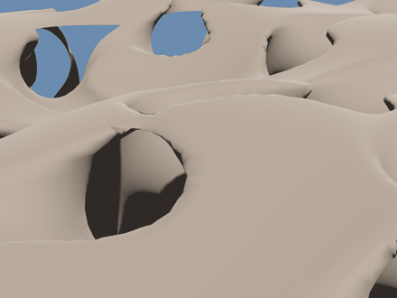
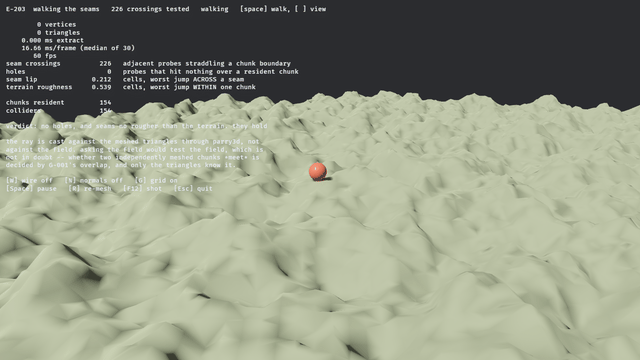

# isomesh

> ⚠️ **Vibe Coded.** This crate was written by an AI agent working from a research corpus and a ticket queue. Every number below is produced by a test in this repository and every algorithm cites its source, but it has not been through human code review. Read the tests before trusting it with anything that matters.

**Engine-agnostic isosurface extraction in Rust. Signed distance field in, triangles out.**

`isomesh` has to serve both a real-time voxel game and a CAD tool. That single constraint decides almost everything about it: no math library appears in a public signature, output buffers are caller-provided and reusable, the scalar type is generic over `f32` and `f64`, and the core crate has exactly one dependency.

## You cannot store this as a height



*A camera flying **through** the rock — under arches, into tunnels, out the far side. 440,000 triangles
across 376 streamed chunks at 60 fps, meshed while the camera moved.*

The field is nine lines and nothing in it is authored:

```text
solid(p) = max( p.y − height(x, z) ,  |gyroid(p)| − thickness )
```

A `max` is an intersection, so rock exists only where a point is **below the terrain surface** *and*
**inside a thickened gyroid**. The gyroid is triply periodic — it tunnels in `x`, `y` and `z` by
construction — so the result has caves that connect, arches carrying rock over open ground, and
ceilings.

A heightfield stores one number per column. It cannot represent any of those, which is the entire
reason to reach for a voxel mesher instead of a quadtree of grids.

```bash
cd bevy_isomesh && cargo run --example game_showcase --release
```

---

## 495 seam crossings, zero holes



*Nothing here is pre-baked. Every chunk under that ball was extracted while the camera flew toward it,
on a background thread, under a frame budget — and the ball is standing on the **triangles**, not on the
field they came from.*

That last part is the whole test. Chunks are meshed independently, so whether two of them actually
*meet* is decided by the overlap the chunk layout chose. Get it wrong and a player falls through the
world at a boundary — a bug that is invisible in every screenshot and fatal in every playthrough.

So the demo counts rather than asserts. It casts a dense transect of rays straight down against the
meshed triangles, every frame, through `parry3d`:

| | |
|---|---|
| seam crossings tested | **495** |
| probes that hit nothing | **0** |
| worst vertical step **across** a seam | **0.412 cells** |
| worst vertical step **within** one chunk | **0.539 cells** |

The seams are measurably smoother than the terrain they join. That comparison is the point — a fixed
height threshold would have been measuring the landscape rather than the joins.

Meanwhile the frame time does not move: **60 fps at 16.65 ms/frame** with 234 chunks resident and
117,792 triangles, while chunks load and unload continuously. Meshing runs on the task pool; what the
frame budget bounds is turning finished extractions into assets.

```bash
cd bevy_isomesh && cargo run --example game_walk --release
```

---

## Marching Cubes returns 0 triangles here. Subgrid returns 1,340.

A feature thinner than a voxel does not exist to a method that asks *"what sign is this grid corner"* —
one bit per edge, and a thin sheet fits between the samples. **M-67** puts a number on the gap: a sign
test cannot distinguish **95.6%** of the configurations a tetrahedron can actually be in.

`isomesh` ships **subgrid Marching Tetrahedra**, which asks instead for *every zero along the edge*. On
letters 0.35 voxels thick, Marching Cubes returns **0** triangles and subgrid returns **1,340** — on the
same grid, at any resolution you like.

[See it lose them, on the algorithms page →](docs/demos/algorithms.md)

---

## Status

Early. **Seven** extraction algorithms — including one that resolves features thinner than a voxel, which nothing else here can do — three normal-estimation strategies, a validity harness, an accuracy harness, a measured shootout between them, collider readiness, field-derived LOD, Transvoxel seams, chunk streaming, and a Bevy plugin that meshes off the main thread. 82 tickets done, 6 open.

| | |
|---|---|
| **Working** | Marching Cubes · **Marching Cubes 33's asymptotic decider** · Marching Tetrahedra · Surface Nets · **Dual Contouring** · **Manifold Dual Contouring** · greedy quads · Hermite data · mesh validity harness · accuracy harness · **six-algorithm shootout** · chunk coordinates · dirty-set re-meshing · brushes · self-intersection counter · determinism harness · seven reference fields · property tests · vertex welding · **collider readiness** · **field-derived LOD** · **Transvoxel transition cells** · **frame-budget scheduling** · **subgrid Marching Tetrahedra** · **chunk streaming with hysteresis** · Bevy 0.19 bridge and plugin |
| **Not yet** | Marching Cubes 33's interior test · simplicial embedding for subgrid MT (A-014d) · convex decomposition · GPU path **in Bevy** (the compute kernel itself runs — see `isomesh-gpu`) |
| **Deliberately absent** | any math library in the public API · any `bevy` mention under `crates/` · any performance number without a committed benchmark |

The name is reserved on crates.io at `0.0.2` — a placeholder, not a release.

---

## Why this exists

Nothing on crates.io does all four of: `no_std`, `f32` **and** `f64`, sharp-feature extraction, and no math library pinned into the public API.

| Crate | Why it doesn't cover this | Last release |
|---|---|---|
| `fast-surface-nets` | Surface Nets only; `SignedDistance: Into<f32>` forecloses `f64`; pins glam 0.29 | 2025-01 |
| `block-mesh` | Blocky quads only | 2022-04 |
| `isosurface` | Right architecture, dead crate | 2021-01 |
| `building-blocks` | Repo archived | 2023-11 |
| `tessellation` | Healthy Manifold Dual Contouring — nalgebra-locked | 2026-03 |
| `fidget-mesh` | Very active — nalgebra-locked, coupled to fidget's evaluator | 2026-08 |

The math-library pin is the load-bearing one. Bevy 0.19 wants glam 0.32, `parry3d` wants 0.33, `fast-surface-nets` wants 0.29 — a consumer using two of those compiles incompatible `Vec3` types and finds out at the type level, much later. So every public signature here is `[f32; 3]` and `[u32; 3]`.

---

## Demos

The rest of the pictures live on three pages, so this one stays short. Every figure on them came from a
command you can run, and every number is measured on the machine in `FINDINGS.md`'s header rather than
quoted from a paper.

| | |
|---|---|
| **[Gameplay](docs/demos/gameplay.md)** | streaming a world past a camera · walking every chunk seam with a rigid body · digging tunnels · shooting a wall so the debris *is* the boolean · spraying graffiti that survives the wall being blown open · flying an LOD ladder and counting what opens up · handing a mesh to a physics engine |
| **[Algorithms](docs/demos/algorithms.md)** | Marching Cubes · Surface Nets · Dual Contouring · Manifold Dual Contouring · Marching Tetrahedra · greedy quads · subgrid Marching Tetrahedra, and a six-way shootout in one process |
| **[Correctness](docs/demos/correctness.md)** | where a mesh stops being a manifold · what splitting the vertex costs · which way the surface faces · ambiguous faces · the crack between two chunks |

Between them they carry 29 demos, 7 GIFs and every measured figure this crate makes a claim about.

---

## What gets checked

Every extraction algorithm ships with these before it counts as done. They are ordinary public API, not test-only, because a consumer baking colliders wants them too.

| Check | Catches |
|---|---|
| Euler characteristic, genus, components, boundary loops | case-table errors; distinguishes a hole from a handle |
| Non-manifold **edges** (≥3 faces) and **vertices** (link walk) | the bowtie — two cones sharing an apex, which "incident faces == incident edges" reports as clean |
| Edge orientation consistency | a single flipped triangle, which passes χ *and* both manifold checks while being inside out |
| Self-intersections per 1,000 triangles | reported as a rate, never as a fraction-of-meshes, which saturates with chunk size |
| Determinism | compared bit-wise via `total_cmp`, because `==` is wrong in both directions on floats |
| Golden hashes over 147 (algorithm, field, resolution) combinations | a change that is topologically identical, geometrically indistinguishable and statistically invisible — the silent diff every other check shrugs at |
| Signed volume | global inversion, which nothing else here can see |
| Hausdorff distance, both directions, and mean absolute error | a mesh that is perfectly valid and in the wrong place. Only the reverse direction sees *missing* geometry — deleting one face of a test octahedron leaves the forward number bit-identical |

`FINDINGS.md` is the epistemic state: what is believed, how strongly, and on what evidence, with tiers for measured-here, verified-from-primary-source, reported, and folklore. Seventeen entries are in the falsified section, several of them corrections to this project's own documents, and the predictions are registered *before* the measurement so a wrong one stays on the record.

---

## Design decisions you'd otherwise have to reverse-engineer

- **Negative is inside.** A sample of exactly zero is *outside*. Choosing strict `< 0` means a cut edge always has one strictly-negative endpoint, so the interpolation `t = a/(a−b)` can never divide by zero — the epsilon guard usually written there is not merely unnecessary but harmful, since it snaps resolvable crossings to the edge midpoint.
- **Counter-clockwise from outside**, right-handed. Verified by signed volume, not by looking at it.
- **`x` varies fastest**: `i = x + y·sx + z·sx·sy`. Stated as strides because "row-major" is ambiguous in three dimensions.
- **One dependency: `libm`**, used unconditionally rather than behind a `std` switch. Two float backends would mean two sets of results, and `std`'s `sin`/`cos` differ between macOS and Linux, which would make committed golden hashes platform-specific. It costs nothing: `libm::sqrtf` lowers to `fsqrt` on aarch64 and `sqrtss` on x86-64.
- **The Marching Cubes table is derived at compile time, not transcribed.** The papers are in the local corpus but their case tables did not survive PDF conversion — figures of cube diagrams and scrambled cells. Reading triangulations off diagrams is guessing. The construction walks each face counter-clockwise from outside; every cut edge then has exactly one entry and one exit, so the segments close into cycles with nothing left over. Cross-checked against a published table: **all 256 cases produce the identical surface, zero disagreements.**
- **Errors are returned, never panicked.** Where possible the invalid state is made unrepresentable instead — `ValidateConfig` has private fields and one checked constructor, so the validator needs no runtime guard at all.

---

## Layout

```
crates/isomesh/      core. no_std + alloc, one dependency, arrays in every public signature
bevy_isomesh/        Bevy 0.19 bridge and ALL examples. Its own workspace and lockfile.
docs/research/       the papers-derived research this is built on
FINDINGS.md          what we believe and on what evidence
BACKLOG.md           the work queue, and the state
```

`bevy_isomesh` is excluded from the root workspace deliberately: with a shared one, Cargo's feature unification hands glam the `std`, `serde`, `bytemuck` and `encase` features Bevy asks for, and `cargo test` stops testing what a consumer actually gets.

The examples live in `bevy_isomesh` and CI compiles them on every push. That is not tidiness — it is the one thing that stops them rotting. `block-mesh`'s examples are pinned to Bevy 0.13 and `fast-surface-nets`' to Bevy 0.7, both because they lived somewhere nothing ever built.

---

## Running it

```bash
cargo test -p isomesh                    # 457 tests, plus 11 doctests
cargo tree -p isomesh -e normal          # exactly two packages: isomesh, libm

cd bevy_isomesh
cargo run --example marching_cubes_sphere --release             # the first GIF
cargo run --example surface_nets_vs_marching_cubes --release    # the second and third
cargo run --example dual_contouring_cube --release              # the sharp-feature comparison
cargo run --example sharp_features --release                    # lambda, and what it costs at both ends
cargo run --example qef_clamp --release                         # the clamp, and the red it does not remove
cargo run --example precision_f32_vs_f64 --release               # why CAD needs f64, in two laws
cargo run --example hermite_debug --release                      # what the QEF actually sees
cargo run --example manifold_check --release                    # the red marks, and A to make them go
cargo run --example normal_estimation --release                 # three identical meshes, three shadings
cargo run --example marching_tetrahedra --release               # 3x the triangles, and what they buy
cargo run --example greedy_quads --release                      # 5014 quads down to 1089
cargo run --example transvoxel_seams --release                  # the LOD crack, and T to close it
cargo run --example subgrid_features --release                   # letters thinner than a voxel
cargo run --example game_terrain_stream --release                # a world streaming past you
cargo run --example game_walk --release                          # the acid test: walk every seam
cargo run --example game_capsule_walk --release                  # the same seams, with a body that slides
cargo run --example game_destruction --release                   # shoot it, and the debris is the boolean
cargo run --example game_lod_flyover --release                   # LOD ladder, and the crack count as you fly
cargo run --example game_showcase --release                      # caves, arches, and a roof over your head
cargo run --example game_budget --release                        # 288 chunks re-meshed without missing a frame
cargo run --example game_editor --release                        # undo as a re-fold, and the log's order audited
cargo run --example game_csg_props --release                     # a concave edge, moving, measured every frame
cargo run --example game_paint --release                         # graffiti, then a hole through it, drift 0.000000
cargo run --example resolution_plot --release                    # the fit, and where the model stops describing it
cargo run --example game_dig --release                          # carve, and watch the chunk count
cargo run --example chunk_seam_weld --release                   # the seam, and welding it
cargo run --example marching_cubes_ambiguity --release          # the decider, and how rarely it fires
```

**Always `--release`.** A debug build meshes 20–50× slower and will convince you something is wrong with the algorithm.

Keys: `W` wireframe · `N` normals · `G` grid · `[` `]` resolution · `1`–`5` field · `S` smoothing · `F12` screenshot · `Esc` quit. Drag to orbit, scroll to zoom.

**Every image in this README and on the demo pages was produced from a command line, and can be
regenerated from one.** No screenshot here was framed by hand, which is what stops the pictures drifting
from the code that made them.

A frame sequence, which is where the GIFs come from:

```bash
ISOMESH_VIEW=nohud ISOMESH_CAPTURE=/tmp/frames ISOMESH_CAPTURE_FRAMES=56 \
  cargo run --example subgrid_features --release
ffmpeg -framerate 12 -i /tmp/frames/frame_%04d.png \
  -vf "scale=780:-1,split[a][b];[a]palettegen=max_colors=128:reserve_transparent=0[p];[b][p]paletteuse" \
  docs/gifs/subgrid-letters-thinner-than-a-voxel.gif
```

An example driving its own parameter sweep reads `Capture::taken` rather than the clock, so a sequence
is reproducible frame for frame instead of depending on how fast the machine ran.

A single still, which is where the numbers come from — the HUD *is* the evidence, so stills keep it and
GIFs drop it with `nohud`:

```bash
ISOMESH_ALGORITHM=sn ISOMESH_FIELD=5 ISOMESH_SAMPLES=19 \
  ISOMESH_SCREENSHOT=../docs/screenshots/e111-manifold-check-gyroid-surface-nets.png \
  cargo run --example manifold_check --release
```

`ISOMESH_SCREENSHOT` takes one shot and exits. `ISOMESH_FIELD`, `ISOMESH_SAMPLES`, `ISOMESH_VIEW`
(`wire`, `normals`, `nogrid`, `nohud`), `ISOMESH_ALGORITHM`, `ISOMESH_CLAMP`, `ISOMESH_OFFSET` and `ISOMESH_WELD`
set what it is a shot *of*.

---

## Requirements

Rust **1.85** (edition 2024), checked in CI against the declared MSRV. The Bevy bridge pins **Bevy 0.19**, which pins wgpu 29.0.3, glam 0.32 and encase 0.12 — those move together or not at all, because Cargo will silently resolve two wgpu majors side by side and the failure only surfaces later as `expected TextureFormat, found a different TextureFormat`.

Developed on macOS / arm64 / Metal. CI runs Linux and macOS, which is what makes the bit-reproducibility claim checkable rather than asserted.

---

## License

MIT OR Apache-2.0, at your option.
