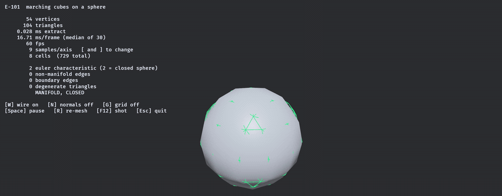
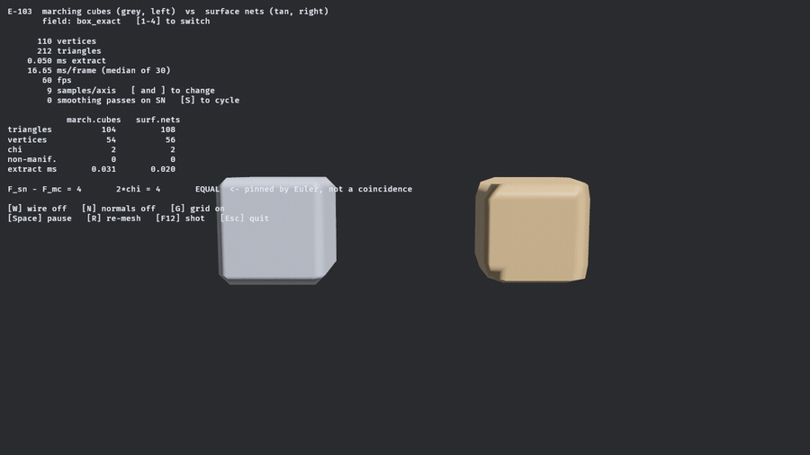
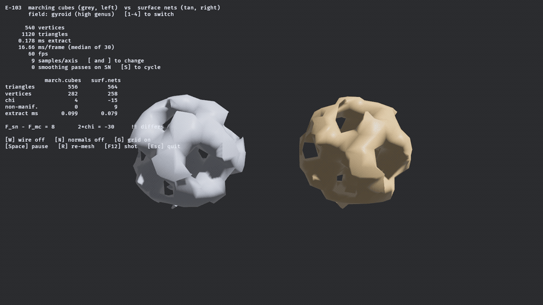
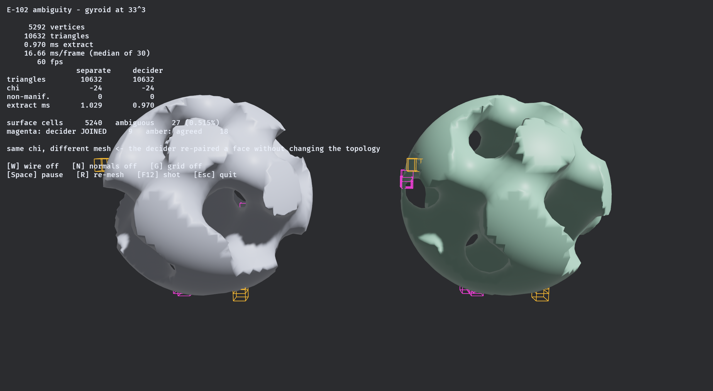

# isomesh

> ⚠️ **Vibe Coded.** This crate was written by an AI agent working from a research corpus and a ticket queue. Every number below is produced by a test in this repository and every algorithm cites its source, but it has not been through human code review. Read the tests before trusting it with anything that matters.

**Engine-agnostic isosurface extraction in Rust. Signed distance field in, triangles out.**

`isomesh` has to serve both a real-time voxel game and a CAD tool. That single constraint decides almost everything about it: no math library appears in a public signature, output buffers are caller-provided and reusable, the scalar type is generic over `f32` and `f64`, and the core crate has exactly one dependency.



*Marching Cubes over a sphere SDF, resolution sweeping from 9³ to 81³. The readout is not decoration — it is the crate's own validity harness, re-run on the mesh being displayed every time it changes. `χ = 2`, zero non-manifold edges, zero boundary edges, every frame.*

---

## Status

Early. Six extraction algorithms, three normal-estimation strategies, a validity harness, an accuracy harness, a measured shootout between them, and a Bevy bridge. Forty-two tickets done, thirty-six open.

| | |
|---|---|
| **Working** | Marching Cubes · **Marching Cubes 33's asymptotic decider** · Marching Tetrahedra · Surface Nets · **Dual Contouring** · **Manifold Dual Contouring** · greedy quads · Hermite data · mesh validity harness · accuracy harness · **five-algorithm shootout** · chunk coordinates · dirty-set re-meshing · brushes · self-intersection counter · determinism harness · seven reference fields · property tests · vertex welding · Bevy 0.19 bridge |
| **Not yet** | Marching Cubes 33's interior test · subgrid Marching Tetrahedra · LOD · Transvoxel *(case table done, extraction not)* · colliders · GPU path |
| **Deliberately absent** | any math library in the public API · any `bevy` mention under `crates/` · any performance number without a committed benchmark |

Not published to crates.io. Version `0.0.0`.

---

## Why this exists

Nothing on crates.io does all four of: `no_std`, `f32` **and** `f64`, sharp-feature extraction, and no math library pinned into the public API.

| Crate | Why it doesn't cover this | Last release |
|---|---|---|
| `fast-surface-nets` | Surface Nets only; `SignedDistance: Into<f32>` forecloses `f64`; pins glam 0.29 | 2025-01 |
| `block-mesh` | Blocky quads only | 2022-04 |
| `isosurface` | Right architecture, dead crate | 2021-01 |
| `building-blocks` | Repo archived | 2023-11 |
| `tessellation` | Healthy Manifold Dual Contouring — nalgebra-locked | 2026-03 |
| `fidget-mesh` | Very active — nalgebra-locked, coupled to fidget's evaluator | 2026-08 |

The math-library pin is the load-bearing one. Bevy 0.19 wants glam 0.32, `parry3d` wants 0.33, `fast-surface-nets` wants 0.29 — a consumer using two of those compiles incompatible `Vec3` types and finds out at the type level, much later. So every public signature here is `[f32; 3]` and `[u32; 3]`.

---

## What it looks like

```rust
use isomesh::{MeshBuffer, RuntimeShape3};
use isomesh::fields::Sphere;
use isomesh::mc::MarchingCubes;

let mut mc = MarchingCubes::<f32>::new();   // owns its scratch; reuse across chunks
let mut out = MeshBuffer::<f32>::new();     // caller-provided; reset() keeps capacity

let shape = RuntimeShape3::new([33; 3])?;
mc.extract(&Sphere::canonical(), &shape, [-2.0; 3], 0.125, &mut out)?;
```

Anything implementing `Sdf` works as input; anything implementing `MeshSink` works as output. `bevy_isomesh::MeshBuilder` is a sink whose buffers *are* a Bevy `Mesh`'s attribute arrays, so extraction writes straight into the asset with no intermediate copy.

---

## Two algorithms, side by side



*Marching Cubes (grey) and Surface Nets (tan) on the same box SDF at the same resolution, sweeping 9³ to 57³.*

Watch the bottom row. **The triangle counts differ by exactly `2χ` — four, on a genus-0 surface — at every resolution.** That is not a coincidence and it contradicts both this project's own brief and the usual folklore that Surface Nets is the cheaper method by output size:

> Marching Cubes places one vertex per crossed grid edge, so `V_mc = C`. Surface Nets emits two triangles per crossed grid edge, so `F_sn = 2C`. Every closed triangulated surface obeys `F = 2V − 2χ`. Therefore `F_sn = F_mc + 2χ`, always. (A-015 gave some cells an extra interior vertex to keep the mesh manifold; it is measured never to fire under plain Marching Cubes, so `V_mc = C` still holds exactly.)

Verified across five fields × three resolutions, including a two-component field where `χ = 4` so the difference is **8** and cannot be confused with a constant. What Surface Nets actually buys is quad connectivity and one vertex per *cell* rather than per *edge* — not fewer triangles.

And it is not the cheaper method by time either, which took a benchmark to find out. The two curves are not parallel — one converges and the other degrades:

| samples per axis | 16 | 48 | 64 | 128 | 256 |
|---|---:|---:|---:|---:|---:|
| Surface Nets / Marching Cubes — **Apple M5** | 0.34 | 0.74 | 1.06 | 1.94 | **2.65** |
| Surface Nets / Marching Cubes — **Ryzen 9 5900X** | 2.46 | 3.06 | 3.36 | 4.16 | **3.72** |

Surface Nets loses, and it loses on both machines — **run on two, not one**. What does *not* transfer is the shape. On the M5 Surface Nets wins below roughly 48³ because Marching Cubes' per-sample cost starts at 25 ns and falls to 4.78 as the `O(n²)` surface term amortises away; on Zen 3 that fall never happens — Marching Cubes is flat at 13–15 ns from 16³ up — so Surface Nets is behind at **every** resolution measured and there is no crossover at all. Surface Nets' per-sample cost climbs on both (8.4 → 12.7 ns on the M5, 37.4 → 49.1 on Zen 3), which is what makes the verdict an algorithm property rather than one cache hierarchy. Sphere, f32, single thread. Raw data in `docs/measurements/resolution_sweep.csv` and `resolution_sweep-ryzen9-5900x.csv`.

So both halves of the usual case for Surface Nets — fewer triangles, lower cost — are falsified by measurement in this repository. What it actually buys is quad connectivity and one vertex per cell.


*`dual_contouring_cube` — the same box, the same 19³ grid, the same edge crossings. Surface Nets on the left, Dual Contouring on the right. The only difference between the two meshes is one function: where a cell's vertex goes. Both emit **972 triangles** with identical connectivity. On [`csg_difference`](docs/screenshots/e104-dual-contouring-csg.png) the concave seam holds too.*

The corners are the real difference, and dual contouring is what closes them. Measured on `box_exact` at 27³ — a resolution deliberately **not** aligned to the box faces, since on an aligned grid this measures the sign-classification rule rather than the algorithm:

| nearest vertex to the corner `(1,1,1)` | world | cells |
|---|---:|---:|
| Surface Nets | 0.0888 | **0.58** |
| Dual Contouring | 0.0009 | **0.01** |

Guaranteed intersection-free extraction turns out to be free, which is not what the folklore predicts. Confining each solved vertex to its own cell drives self-intersections to **exactly zero** on five of the seven test fields — `torus` goes 2.66 → 0 pairs per 1,000 triangles — and the corner above measures **identically** clamped or not, because a convex corner's solution is already inside its cell. What survives the clamp is 3.12 on the gyroid and 13.84 on fbm terrain, and those are precisely the two fields where two sheets of surface share a cell: a connectivity defect, not a placement one.

It costs about **3%** over Surface Nets to do it, and the two meshes are otherwise the same mesh: identical index buffers, and 864 of 1016 vertices agreeing to within `2e-15` cells. Only the 152 on edges and corners move.

---

## Where an algorithm breaks, measured rather than described



*The capped gyroid — triply periodic, high genus. Marching Cubes stays manifold here; Surface Nets does not.*

Surface Nets places exactly one vertex per cell. Where two sheets of the surface pass through the same cell they are forced to share it, and the result is non-manifold — **42 non-manifold edges at 25³** in the sequence above, against Marching Cubes' zero at every resolution in it. The literature review calls this dual contouring's *"actual structural defect"*. It is fixed below, and the fix has a cost that is also measured.

Notice that the Euler identity now reads **`!! differs`**. That is correct: the identity's precondition is a *closed manifold*, and Surface Nets' output here is not one. The condition under which the assertion should fail is recorded next to the assertion, so when it does fail nobody mistakes it for a regression.

This is the crate's actual pitch. Not "the meshes look right" — a wrong mesh looks right — but that every mesh is measured, the measurements are in the test suite, and the ones that contradict the documentation are written down.

---

## Where a mesh stops being a manifold


*`manifold_check` — the capped gyroid at 19³ under Surface Nets. Every red sphere is a non-manifold vertex and every red line a non-manifold edge, drawn where the validator found them: 39 edges and 61 vertices, clustered around the tunnel mouths where two sheets of surface share a cell. The same field and grid under Marching Cubes reports `0` on every counter and `MANIFOLD, CLOSED` ([screenshot](docs/screenshots/e111-manifold-check-gyroid-marching-cubes.png)).*

A count tells you a mesh is broken without telling you where, and the two most useful findings in this project were both about *where*. The marks come from `validate_features`, which returns the offending edges and vertices from the **same pass** that produced the numbers beside them — so the picture and the caption cannot drift apart.

```bash
cd bevy_isomesh && cargo run --example manifold_check --release
```

`1`–`7` field · `A` algorithm · `B` boundary overlay · `[` `]` resolution.

---

## Splitting the vertex, and what it costs


*The same field, the same 19³ grid, one algorithm apart. **Dual Contouring: 39 non-manifold edges, 61 non-manifold vertices, `χ = -10`, one component.** **Manifold Dual Contouring: zero, zero, `χ = -2`, seven components** — and the same 3,276 triangles. Press `A` in `manifold_check` to switch between them.*

One vertex per cell is the defect. The fix is one vertex per **surface component**: the cell's cut edges are partitioned into the cycles the Marching Cubes table already links them into, and each cycle gets its own QEF solve. Ju's own paper describes it and credits it to Nielson — the output is the *dual* of the Marching Cubes surface, so it inherits Marching Cubes' topology.

That inheritance is asserted, not assumed. On every closed field at 17³, 25³ and 33³ the dual reproduces Marching Cubes' Euler characteristic **and its component count** exactly. Look again at the two captions: the pinch was not only breaking the index buffer, it was **fusing seven pieces into one and misreporting `χ` by eight**.

Three things this measured that were not what the tickets predicted:

- **The cost is zero on five of the seven fields**, and about **5%** of the run time on the other two. Only `gyroid` and `fbm_terrain` ever need a second vertex in a cell, and their rate *falls* with resolution — 3.13% → 2.05% → 0.53% at 17³/25³/33³. Nielson's published *"about 1.3%"* counts entries in the case table, not cells in a scene. Triangle counts are unchanged: splitting moves vertices without adding quads.
- **Self-intersections get worse, not better** — `gyroid` 3.118 → 5.669 per 1,000 triangles, `fbm_terrain` 13.837 → 15.434. The prediction registered before the run said the opposite. Two vertices in one cell is exactly what breaks the within-cell partition the clamp's guarantee rests on, and a 2024 result reporting Manifold Dual Contouring as 100% self-intersecting was on the record the whole time.
- **A second, unrelated non-manifold mechanism exists.** The dual of a manifold surface is a manifold *complex*, and an index buffer cannot hold two distinct edges between one pair of vertices, so parallel dual edges collapse into one edge with four faces. The property suite found it by shrinking to the exact same three-sphere fixture that falsified unconditional manifoldness for Marching Cubes. It is identified by arithmetic rather than by eye: a collapse costs exactly one edge, so `χ_dual − χ_mc == non_manifold_edges`, measured `1 − 0 == 1` at `h = 2/3` and `0 == 0` at every finer grid.

---

## Which way does the surface face

Three answers, and they are not the same answer. Ask the **field** for its gradient; **difference** the field, which is all a sampled voxel buffer can offer; or take the **area-weighted average of the incident triangles**, which is all a mesh can offer. `normals::recompute` re-derives a finished `MeshBuffer` under any of them, so the choice survives welding and merging instead of being baked in by whichever extractor ran.

Differencing at the cell size — the case a game without an analytic field is stuck with — costs under half a degree, and converges the way it must:

| grid | worst | mean |
|---|---|---|
| 17³ | 0.460° | 0.299° |
| 33³ | 0.121° | 0.079° |
| 65³ | 0.031° | 0.020° |

Successive ratios 3.76 and 3.92, so `h²`, asserted as a range rather than admired in a log.

The third strategy is where it gets interesting. Area-weighted normals track the field closely on smooth geometry and **cannot** on sharp geometry, because a corner vertex gets the average of three face normals where the field's gradient gives one of them. On a sphere the mean disagreement falls 3.25° → 2.16° → 1.08° across those grids and on a torus 11.65° → 6.07° → 2.45°. On `box_exact` the *worst* disagreement is **35.796° at all three resolutions, identical to six figures** — refining a grid does not soften a corner. That invariance is the assertion; the constant is just the box's corner.

---

## Six algorithms, one process, one run

No paper since 2020 benchmarks Marching Cubes against Surface Nets against Dual Contouring, and Surface Nets has no credible published timings at all. So they are measured here — seven fields, two grids, six algorithms, one process — and the headline is not what the folklore says.

| | manifold | intersection-free |
|---|---|---|
| Marching Cubes | ✅ | ✅ |
| Marching Cubes + decider | ✅ | ✅ |
| Marching Tetrahedra | ✅ | ❌ 3.405 / 1k on `csg_difference` |
| Surface Nets | ❌ 128 edges | ✅ |
| Dual Contouring | ❌ 128 edges | ❌ 13.837 / 1k on `fbm_terrain` |
| **Manifold Dual Contouring** | ✅ | ❌ 15.434 / 1k on `fbm_terrain` |

Three of the four corners of that 2×2 are occupied, and **the crude baseline holds the good one**. What Dual Contouring buys instead is accuracy exactly where the features are sharp — symmetric Hausdorff at 65³ against Marching Cubes: `box_exact` **101×** better, `thin_plate` **77.9×**, against `sphere` **1.2×** and `torus` **1.6×**. Two orders of magnitude on a corner and nothing at all on a sphere.

Marching Tetrahedra costs **2.87–3.91×** the triangles — the published "2–3×" covers only the two roughest fields — for **4.3%** worse geometry, where the source it is usually attributed to reads far stronger than that. And it is *better* than Marching Cubes on sharp fields, because its extra edge families sample a corner from more directions.

```bash
cargo bench --bench shootout        # writes docs/measurements/shootout.csv
```

---

## Digging, with the numbers a game actually cares about


*`game_dig` — first person, left click to carve. The blue boxes are the chunks the **last edit** re-meshed: 3 of them, in `0.41 ms`. Nine chunks are resident; the other six were not touched and were not looked at.*

This is the first example where the mesh is rebuilt while someone is holding the mouse down, and it exists to put two numbers on screen that no benchmark can produce:

- **E1 — `265 of 1,728 cells in the brush's bounding box actually re-mesh, 15.3%.`** That is the number the entire incremental story rests on. If it were 100%, being clever about which cells changed would buy nothing over re-meshing the whole box.
- **The trap next to it: `756 cells moved a sample.`** Counting *value* changes rather than *output* changes reads 43% and says incremental meshing is barely worth it; counting output says 15%. The ratio here is `2.85×`, and it was measured offline at 2.8–3.7× before anyone drove it with a mouse.

Edits compose rather than mutate — the field is a stack of brushes over the terrain, which is what makes undo a re-fold of the log rather than a snapshot. So every field sample walks every brush, and the cost grows. Measured over a scripted 60-carve run, median ms per re-meshed chunk:

| edits in the log | 1–15 | 16–30 | 31–45 | 46–60 |
|---|---|---|---|---|
| ms per chunk | 0.158 | 0.354 | 0.525 | 0.589 |

**3.7× for 7× the log, and flattening** — real, and not proportional, which is weaker than "every sample walks every brush" makes it sound.

```bash
cd bevy_isomesh && cargo run --example game_dig --release
```

`LMB` carve · `RMB` fill · `WASD`/`QE` move · `[` `]` radius · `X` clear the log · `C` chunk outlines.

---

## A crack between two chunks, and welding it shut


*`chunk_seam_weld` — one torus, two chunks, meshed **independently**, exactly as a game does when an edit dirties only the chunks it touches. Every red line is a boundary edge on the shared plane: a triangle with no neighbour. `80` of them, and `40` duplicated vertices. The surface looks continuous and is not.*


*The same two chunks after `V`. **`1328 → 1288` vertices, 40 merged, 0 triangles collapsed, and the seam carries no boundary at all.** χ stays `0` — it is a torus either way; what changed is that it is now one surface.*

The spacing selector is the part worth pressing. `1` is `h = 0.125` and `2` is `h = 4/35`, and only one of those is arbitrary: two chunks agree on their shared sample plane bit-for-bit **only when the cell size is a power of two**, because one computes `(o + h·cn) + h·n` and the other `o + h·(c+1)n` — equal by algebra, not by IEEE. 22% of random `(origin, h, cells, chunk)` combinations disagree by an ulp, and `4/35` came out of that search. A weld keyed on exact equality closes the seam under `1` and silently leaves it open under `2`; this one is an epsilon weld for exactly that reason.

```bash
cd bevy_isomesh && cargo run --example chunk_seam_weld --release
```

`V` weld · `E` explode the chunks apart · `1` `2` spacing · `[` `]` resolution.

---

## An ambiguous face, and how rarely one turns up



*`marching_cubes_ambiguity` — plain Marching Cubes on the left, the same extraction with `FaceAmbiguity::AsymptoticDecider` on the right. Every box is a cell with an ambiguous face: **amber where the decider agreed and separated the corners, magenta where it disagreed and joined them.** Magenta is the only place the two meshes can differ, and on the gyroid at 33³ there are nine such cells out of 5,240.*

The catalog originally specified this example as "holes on the left, closed on the right". **That cannot be shown, because it does not happen** — this crate's case table is derived at compile time by walking each face counter-clockwise, so two cells sharing a face cannot disagree about it and neither side ever holes. What the decider changes is *which* surface gets built on an ambiguous face, which the HUD reads off as a difference in Euler characteristic.


*Press `3`. On a sphere there is **not one ambiguous face in 1,160 surface cells**, and the two meshes are byte-identical — which the committed golden fixture also pins. Five of the seven reference fields behave this way; only the gyroid (0.515% of cells) and `fbm_terrain` (1.532%) reach the configuration at all. An example that only ever showed the interesting case would misrepresent how often the interesting case arrives.*

```bash
cd bevy_isomesh && cargo run --example marching_cubes_ambiguity --release
```

`1`–`3` field · `A` cell markers · `[` `]` resolution.

---

## What gets checked

Every extraction algorithm ships with these before it counts as done. They are ordinary public API, not test-only, because a consumer baking colliders wants them too.

| Check | Catches |
|---|---|
| Euler characteristic, genus, components, boundary loops | case-table errors; distinguishes a hole from a handle |
| Non-manifold **edges** (≥3 faces) and **vertices** (link walk) | the bowtie — two cones sharing an apex, which "incident faces == incident edges" reports as clean |
| Edge orientation consistency | a single flipped triangle, which passes χ *and* both manifold checks while being inside out |
| Self-intersections per 1,000 triangles | reported as a rate, never as a fraction-of-meshes, which saturates with chunk size |
| Determinism | compared bit-wise via `total_cmp`, because `==` is wrong in both directions on floats |
| Golden hashes over 147 (algorithm, field, resolution) combinations | a change that is topologically identical, geometrically indistinguishable and statistically invisible — the silent diff every other check shrugs at |
| Signed volume | global inversion, which nothing else here can see |
| Hausdorff distance, both directions, and mean absolute error | a mesh that is perfectly valid and in the wrong place. Only the reverse direction sees *missing* geometry — deleting one face of a test octahedron leaves the forward number bit-identical |

`FINDINGS.md` is the epistemic state: what is believed, how strongly, and on what evidence, with tiers for measured-here, verified-from-primary-source, reported, and folklore. Seventeen entries are in the falsified section, several of them corrections to this project's own documents, and the predictions are registered *before* the measurement so a wrong one stays on the record.

---

## Design decisions you'd otherwise have to reverse-engineer

- **Negative is inside.** A sample of exactly zero is *outside*. Choosing strict `< 0` means a cut edge always has one strictly-negative endpoint, so the interpolation `t = a/(a−b)` can never divide by zero — the epsilon guard usually written there is not merely unnecessary but harmful, since it snaps resolvable crossings to the edge midpoint.
- **Counter-clockwise from outside**, right-handed. Verified by signed volume, not by looking at it.
- **`x` varies fastest**: `i = x + y·sx + z·sx·sy`. Stated as strides because "row-major" is ambiguous in three dimensions.
- **One dependency: `libm`**, used unconditionally rather than behind a `std` switch. Two float backends would mean two sets of results, and `std`'s `sin`/`cos` differ between macOS and Linux, which would make committed golden hashes platform-specific. It costs nothing: `libm::sqrtf` lowers to `fsqrt` on aarch64 and `sqrtss` on x86-64.
- **The Marching Cubes table is derived at compile time, not transcribed.** The papers are in the local corpus but their case tables did not survive PDF conversion — figures of cube diagrams and scrambled cells. Reading triangulations off diagrams is guessing. The construction walks each face counter-clockwise from outside; every cut edge then has exactly one entry and one exit, so the segments close into cycles with nothing left over. Cross-checked against a published table: **all 256 cases produce the identical surface, zero disagreements.**
- **Errors are returned, never panicked.** Where possible the invalid state is made unrepresentable instead — `ValidateConfig` has private fields and one checked constructor, so the validator needs no runtime guard at all.

---

## Layout

```
crates/isomesh/      core. no_std + alloc, one dependency, arrays in every public signature
bevy_isomesh/        Bevy 0.19 bridge and ALL examples. Its own workspace and lockfile.
docs/research/       the papers-derived research this is built on
FINDINGS.md          what we believe and on what evidence
BACKLOG.md           the work queue, and the state
```

`bevy_isomesh` is excluded from the root workspace deliberately: with a shared one, Cargo's feature unification hands glam the `std`, `serde`, `bytemuck` and `encase` features Bevy asks for, and `cargo test` stops testing what a consumer actually gets.

The examples live in `bevy_isomesh` and CI compiles them on every push. That is not tidiness — it is the one thing that stops them rotting. `block-mesh`'s examples are pinned to Bevy 0.13 and `fast-surface-nets`' to Bevy 0.7, both because they lived somewhere nothing ever built.

---

## Running it

```bash
cargo test -p isomesh                    # 345 tests, plus 10 doctests
cargo tree -p isomesh -e normal          # exactly two packages: isomesh, libm

cd bevy_isomesh
cargo run --example marching_cubes_sphere --release             # the first GIF
cargo run --example surface_nets_vs_marching_cubes --release    # the second and third
cargo run --example dual_contouring_cube --release              # the sharp-feature comparison
cargo run --example manifold_check --release                    # the red marks, and A to make them go
cargo run --example game_dig --release                          # carve, and watch the chunk count
cargo run --example chunk_seam_weld --release                   # the seam, and welding it
cargo run --example marching_cubes_ambiguity --release          # the decider, and how rarely it fires
```

**Always `--release`.** A debug build meshes 20–50× slower and will convince you something is wrong with the algorithm.

Keys: `W` wireframe · `N` normals · `G` grid · `[` `]` resolution · `1`–`5` field · `S` smoothing · `F12` screenshot · `Esc` quit. Drag to orbit, scroll to zoom.

Any example can be captured without a keyboard, which is how the GIFs above were made and how they can be regenerated:

```bash
ISOMESH_CAPTURE=/tmp/frames ISOMESH_FIELD=4 ISOMESH_VIEW=wire,nogrid \
  cargo run --example surface_nets_vs_marching_cubes --release
```

`ISOMESH_SCREENSHOT` takes one shot and exits; `ISOMESH_FIELD`, `ISOMESH_SAMPLES`, `ISOMESH_VIEW`, `ISOMESH_ALGORITHM` and `ISOMESH_WELD` set what it is a shot *of*. Every image in this README was produced that way and can be reproduced from a command line — for instance the non-manifold gyroid above:

```bash
ISOMESH_ALGORITHM=sn ISOMESH_FIELD=5 ISOMESH_SAMPLES=19 \
  ISOMESH_SCREENSHOT=../docs/screenshots/e111-manifold-check-gyroid-surface-nets.png \
  cargo run --example manifold_check --release
```

---

## Requirements

Rust **1.85** (edition 2024), checked in CI against the declared MSRV. The Bevy bridge pins **Bevy 0.19**, which pins wgpu 29.0.3, glam 0.32 and encase 0.12 — those move together or not at all, because Cargo will silently resolve two wgpu majors side by side and the failure only surfaces later as `expected TextureFormat, found a different TextureFormat`.

Developed on macOS / arm64 / Metal. CI runs Linux and macOS, which is what makes the bit-reproducibility claim checkable rather than asserted.

## License

MIT OR Apache-2.0, at your option.
