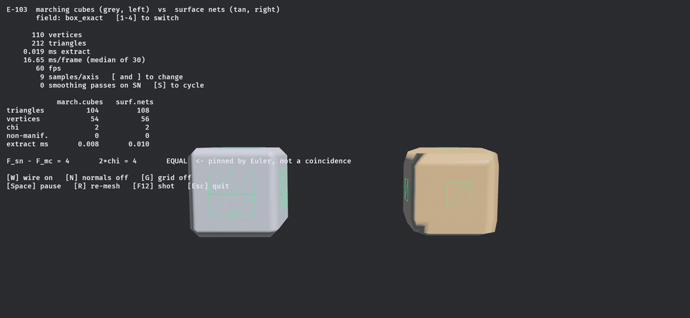
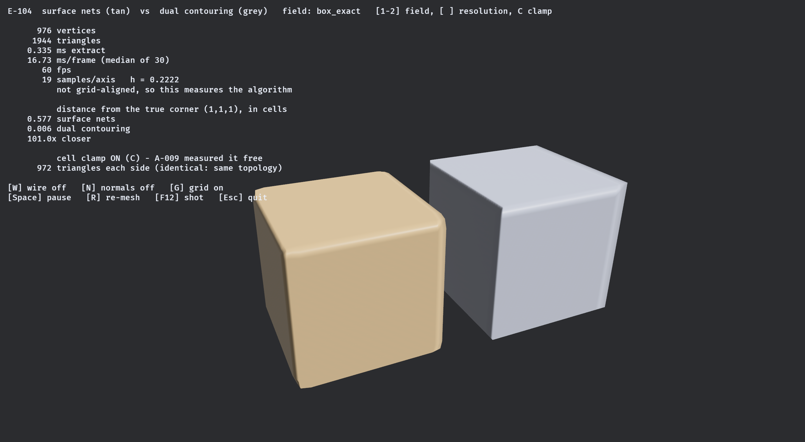
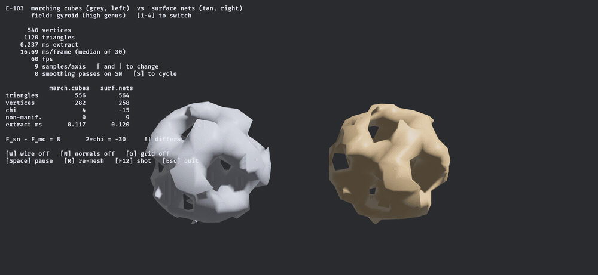
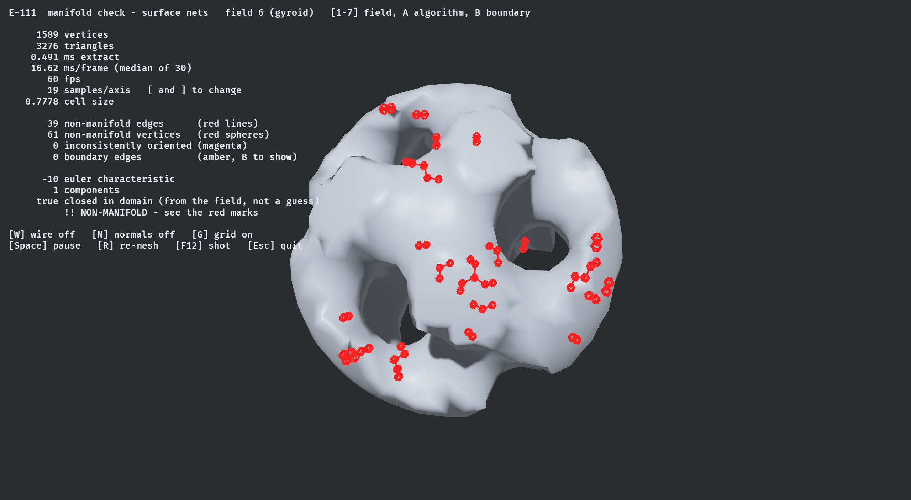

# isomesh

> ⚠️ **Vibe Coded.** This crate was written by an AI agent working from a research corpus and a ticket queue. Every number below is produced by a test in this repository and every algorithm cites its source, but it has not been through human code review. Read the tests before trusting it with anything that matters.

**Engine-agnostic isosurface extraction in Rust. Signed distance field in, triangles out.**

`isomesh` has to serve both a real-time voxel game and a CAD tool. That single constraint decides almost everything about it: no math library appears in a public signature, output buffers are caller-provided and reusable, the scalar type is generic over `f32` and `f64`, and the core crate has exactly one dependency.


*Marching Cubes over a sphere SDF, resolution sweeping from 9³ to 81³. The readout is not decoration — it is the crate's own validity harness, re-run on the mesh being displayed every time it changes. `χ = 2`, zero non-manifold edges, zero boundary edges, every frame.*

---

## Status

Early. Two extraction algorithms, a validity harness, an accuracy harness, and a Bevy bridge. Twenty-six tickets done, forty-six open.

| | |
|---|---|
| **Working** | Marching Cubes · Surface Nets · **Dual Contouring** · Hermite data · mesh validity harness · accuracy harness · chunk coordinates · self-intersection counter · determinism harness · seven reference fields · property-test scaffolding · Bevy 0.19 bridge |
| **Not yet** | MC33 · marching tetrahedra · greedy quads · LOD / Transvoxel · vertex welding · colliders · GPU path · benchmarks |
| **Deliberately absent** | any math library in the public API · any `bevy` mention under `crates/` · any performance number without a committed benchmark |

Not published to crates.io. Version `0.0.0`.

---

## Why this exists

Nothing on crates.io does all four of: `no_std`, `f32` **and** `f64`, sharp-feature extraction, and no math library pinned into the public API.

| Crate | Why it doesn't cover this | Last release |
|---|---|---|
| `fast-surface-nets` | Surface Nets only; `SignedDistance: Into<f32>` forecloses `f64`; pins glam 0.29 | 2025-01 |
| `block-mesh` | Blocky quads only | 2022-04 |
| `isosurface` | Right architecture, dead crate | 2021-01 |
| `building-blocks` | Repo archived | 2023-11 |
| `tessellation` | Healthy Manifold DC — nalgebra-locked | 2026-03 |
| `fidget-mesh` | Very active — nalgebra-locked, coupled to fidget's evaluator | 2026-08 |

The math-library pin is the load-bearing one. Bevy 0.19 wants glam 0.32, `parry3d` wants 0.33, `fast-surface-nets` wants 0.29 — a consumer using two of those compiles incompatible `Vec3` types and finds out at the type level, much later. So every public signature here is `[f32; 3]` and `[u32; 3]`.

---

## What it looks like

```rust
use isomesh::{MeshBuffer, RuntimeShape3};
use isomesh::fields::Sphere;
use isomesh::mc::MarchingCubes;

let mut mc = MarchingCubes::<f32>::new();   // owns its scratch; reuse across chunks
let mut out = MeshBuffer::<f32>::new();     // caller-provided; reset() keeps capacity

let shape = RuntimeShape3::new([33; 3])?;
mc.extract(&Sphere::canonical(), &shape, [-2.0; 3], 0.125, &mut out)?;
```

Anything implementing `Sdf` works as input; anything implementing `MeshSink` works as output. `bevy_isomesh::MeshBuilder` is a sink whose buffers *are* a Bevy `Mesh`'s attribute arrays, so extraction writes straight into the asset with no intermediate copy.

---

## Two algorithms, side by side



*Marching Cubes (grey) and Surface Nets (tan) on the same box SDF at the same resolution, sweeping 9³ to 57³.*

Watch the bottom row. **The triangle counts differ by exactly `2χ` — four, on a genus-0 surface — at every resolution.** That is not a coincidence and it contradicts both this project's own brief and the usual folklore that Surface Nets is the cheaper method by output size:

> Marching Cubes places one vertex per crossed grid edge, so `V_mc = C`. Surface Nets emits two triangles per crossed grid edge, so `F_sn = 2C`. Every closed triangulated surface obeys `F = 2V − 2χ`. Therefore `F_sn = F_mc + 2χ`, always.

Verified across five fields × three resolutions, including a two-component field where `χ = 4` so the difference is **8** and cannot be confused with a constant. What Surface Nets actually buys is quad connectivity and one vertex per *cell* rather than per *edge* — not fewer triangles.

And it is not the cheaper method by time either, which took a benchmark to find out. The two curves are not parallel — one converges and the other degrades:

| samples per axis | 16 | 48 | 64 | 128 | 256 |
|---|---:|---:|---:|---:|---:|
| **MC** ms | 0.090 | 1.251 | 2.246 | 10.195 | **80.257** |
| **SN** ms | 0.038 | 0.976 | 2.425 | 20.006 | **221.223** |
| SN / MC | 0.42 | 0.78 | 1.08 | 1.96 | **2.76** |

Surface Nets wins below roughly 48³ and loses steadily above it. Marching Cubes' per-sample cost *falls* from 21.9 to 4.78 ns as the `O(n²)` surface term amortises away, then holds flat; Surface Nets' sits near 9 ns and then *climbs* to 13.19. Its fitted `t = a + b·n³` even comes back with a **negative** fixed cost, which is impossible and is the model saying its cost grows faster than `n³`. Sphere, f32, single thread, Apple M5 — one machine, so treat the mechanism as unconfirmed. Raw data in `docs/measurements/resolution_sweep.csv`.

So both halves of the usual case for Surface Nets — fewer triangles, lower cost — are falsified by measurement in this repository. What it actually buys is quad connectivity and one vertex per cell.



*`dual_contouring_cube` — the same box, the same 19³ grid, the same edge crossings. Surface Nets on the left, Dual Contouring on the right. The only difference between the two meshes is one function: where a cell's vertex goes. Both emit **972 triangles** with identical connectivity. On [`csg_difference`](docs/screenshots/e104-dual-contouring-csg.png) the concave seam holds too.*

The corners are the real difference, and dual contouring is what closes them. Measured on `box_exact` at 27³ — a resolution deliberately **not** aligned to the box faces, since on an aligned grid this measures the sign-classification rule rather than the algorithm:

| nearest vertex to the corner `(1,1,1)` | world | cells |
|---|---:|---:|
| Surface Nets | 0.0888 | **0.58** |
| Dual Contouring | 0.0009 | **0.01** |

Guaranteed intersection-free extraction turns out to be free, which is not what the folklore predicts. Confining each solved vertex to its own cell drives self-intersections to **exactly zero** on five of the seven test fields — `torus` goes 2.66 → 0 pairs per 1,000 triangles — and the corner above measures **identically** clamped or not, because a convex corner's solution is already inside its cell. What survives the clamp is 3.12 on the gyroid and 13.84 on fbm terrain, and those are precisely the two fields where two sheets of surface share a cell: a connectivity defect, not a placement one.

It costs about **3%** over Surface Nets to do it, and the two meshes are otherwise the same mesh: identical index buffers, and 864 of 1016 vertices agreeing to within `2e-15` cells. Only the 152 on edges and corners move.

---

## Where an algorithm breaks, measured rather than described



*The capped gyroid — triply periodic, high genus. Marching Cubes stays manifold here; Surface Nets does not.*

Surface Nets places exactly one vertex per cell. Where two sheets of the surface pass through the same cell they are forced to share it, and the result is non-manifold — **42 non-manifold edges at 25³** in the sequence above, against Marching Cubes' zero at every resolution in it. The literature calls this dual contouring's *"actual structural defect"*, fixed architecturally by vertex splitting rather than by patching.

Notice that the Euler identity now reads **`!! differs`**. That is correct: the identity's precondition is a *closed manifold*, and Surface Nets' output here is not one. The condition under which the assertion should fail is recorded next to the assertion, so when it does fail nobody mistakes it for a regression.

This is the crate's actual pitch. Not "the meshes look right" — a wrong mesh looks right — but that every mesh is measured, the measurements are in the test suite, and the ones that contradict the documentation are written down.

---

## Where a mesh stops being a manifold



*`manifold_check` — the capped gyroid at 19³ under Surface Nets. Every red sphere is a non-manifold vertex and every red line a non-manifold edge, drawn where the validator found them: 39 edges and 61 vertices, clustered around the tunnel mouths where two sheets of surface share a cell. The same field and grid under Marching Cubes reports `0` on every counter and `MANIFOLD, CLOSED` ([screenshot](docs/screenshots/e111-manifold-check-gyroid-mc.png)).*

A count tells you a mesh is broken without telling you where, and the two most useful findings in this project were both about *where*. The marks come from `validate_features`, which returns the offending edges and vertices from the **same pass** that produced the numbers beside them — so the picture and the caption cannot drift apart.

```bash
cd bevy_isomesh && cargo run --example manifold_check --release
```

`1`–`7` field · `A` algorithm · `B` boundary overlay · `[` `]` resolution.

---

## What gets checked

Every extraction algorithm ships with these before it counts as done. They are ordinary public API, not test-only, because a consumer baking colliders wants them too.

| Check | Catches |
|---|---|
| Euler characteristic, genus, components, boundary loops | case-table errors; distinguishes a hole from a handle |
| Non-manifold **edges** (≥3 faces) and **vertices** (link walk) | the bowtie — two cones sharing an apex, which "incident faces == incident edges" reports as clean |
| Edge orientation consistency | a single flipped triangle, which passes χ *and* both manifold checks while being inside out |
| Self-intersections per 1,000 triangles | reported as a rate, never as a fraction-of-meshes, which saturates with chunk size |
| Determinism | compared bit-wise via `total_cmp`, because `==` is wrong in both directions on floats |
| Golden hashes over 63 (algorithm, field, resolution) combinations | a change that is topologically identical, geometrically indistinguishable and statistically invisible — the silent diff every other check shrugs at |
| Signed volume | global inversion, which nothing else here can see |
| Hausdorff distance, both directions, and mean absolute error | a mesh that is perfectly valid and in the wrong place. Only the reverse direction sees *missing* geometry — deleting one face of a test octahedron leaves the forward number bit-identical |

`FINDINGS.md` is the epistemic state: what is believed, how strongly, and on what evidence, with tiers for measured-here, verified-from-primary-source, reported, and folklore. Sixteen entries are in the falsified section, several of them corrections to this project's own documents.

---

## Design decisions you'd otherwise have to reverse-engineer

- **Negative is inside.** A sample of exactly zero is *outside*. Choosing strict `< 0` means a cut edge always has one strictly-negative endpoint, so the interpolation `t = a/(a−b)` can never divide by zero — the epsilon guard usually written there is not merely unnecessary but harmful, since it snaps resolvable crossings to the edge midpoint.
- **Counter-clockwise from outside**, right-handed. Verified by signed volume, not by looking at it.
- **`x` varies fastest**: `i = x + y·sx + z·sx·sy`. Stated as strides because "row-major" is ambiguous in three dimensions.
- **One dependency: `libm`**, used unconditionally rather than behind a `std` switch. Two float backends would mean two sets of results, and `std`'s `sin`/`cos` differ between macOS and Linux, which would make committed golden hashes platform-specific. It costs nothing: `libm::sqrtf` lowers to `fsqrt` on aarch64 and `sqrtss` on x86-64.
- **The Marching Cubes table is derived at compile time, not transcribed.** The papers are in the local corpus but their case tables did not survive PDF conversion — figures of cube diagrams and scrambled cells. Reading triangulations off diagrams is guessing. The construction walks each face counter-clockwise from outside; every cut edge then has exactly one entry and one exit, so the segments close into cycles with nothing left over. Cross-checked against a published table: **all 256 cases produce the identical surface, zero disagreements.**
- **Errors are returned, never panicked.** Where possible the invalid state is made unrepresentable instead — `ValidateConfig` has private fields and one checked constructor, so the validator needs no runtime guard at all.

---

## Layout

```
crates/isomesh/      core. no_std + alloc, one dependency, arrays in every public signature
bevy_isomesh/        Bevy 0.19 bridge and ALL examples. Its own workspace and lockfile.
docs/research/       the papers-derived research this is built on
FINDINGS.md          what we believe and on what evidence
BACKLOG.md           the work queue, and the state
```

`bevy_isomesh` is excluded from the root workspace deliberately: with a shared one, Cargo's feature unification hands glam the `std`, `serde`, `bytemuck` and `encase` features Bevy asks for, and `cargo test` stops testing what a consumer actually gets.

The examples live in `bevy_isomesh` and CI compiles them on every push. That is not tidiness — it is the one thing that stops them rotting. `block-mesh`'s examples are pinned to Bevy 0.13 and `fast-surface-nets`' to Bevy 0.7, both because they lived somewhere nothing ever built.

---

## Running it

```bash
cargo test -p isomesh                    # 227 tests
cargo tree -p isomesh -e normal          # exactly two packages: isomesh, libm

cd bevy_isomesh
cargo run --example mc_sphere --release  # the first GIF
cargo run --example sn_vs_mc --release   # the second and third
```

**Always `--release`.** A debug build meshes 20–50× slower and will convince you something is wrong with the algorithm.

Keys: `W` wireframe · `N` normals · `G` grid · `[` `]` resolution · `1`–`5` field · `S` smoothing · `F12` screenshot · `Esc` quit. Drag to orbit, scroll to zoom.

Any example can be captured without a keyboard, which is how the GIFs above were made and how they can be regenerated:

```bash
ISOMESH_CAPTURE=/tmp/frames ISOMESH_FIELD=4 ISOMESH_VIEW=wire,nogrid \
  cargo run --example sn_vs_mc --release
```

---

## Requirements

Rust **1.85** (edition 2024), checked in CI against the declared MSRV. The Bevy bridge pins **Bevy 0.19**, which pins wgpu 29.0.3, glam 0.32 and encase 0.12 — those move together or not at all, because Cargo will silently resolve two wgpu majors side by side and the failure only surfaces later as `expected TextureFormat, found a different TextureFormat`.

Developed on macOS / arm64 / Metal. CI runs Linux and macOS, which is what makes the bit-reproducibility claim checkable rather than asserted.

## License

MIT OR Apache-2.0, at your option.
