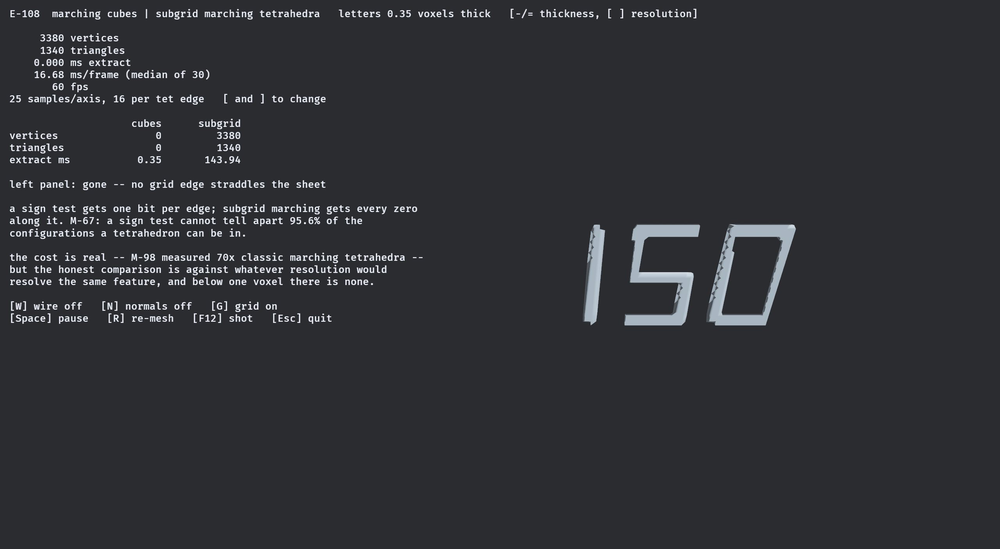
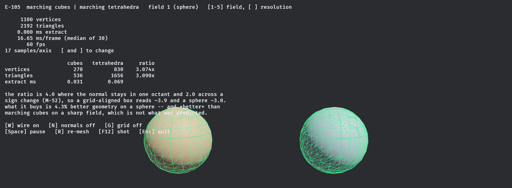
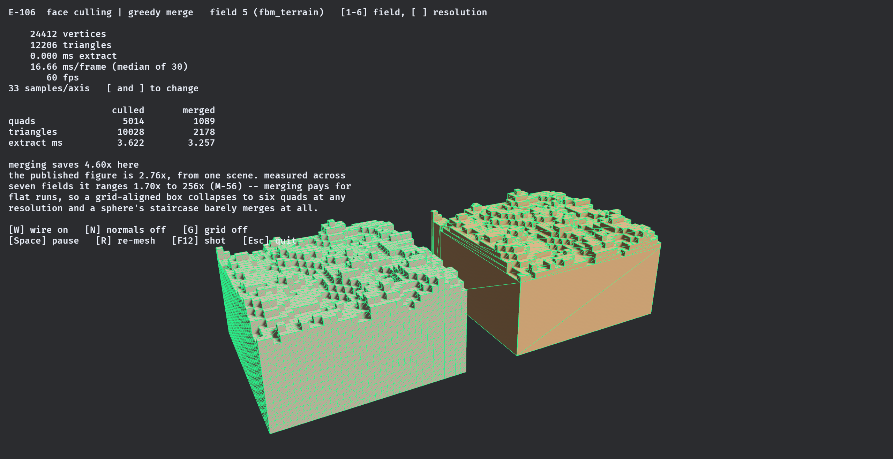
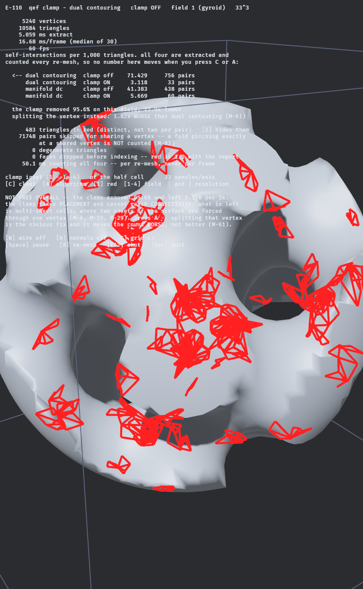
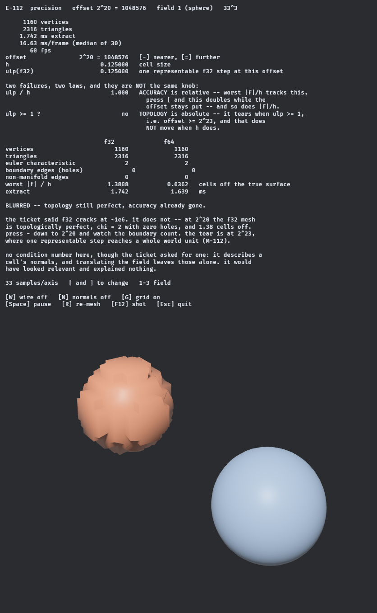
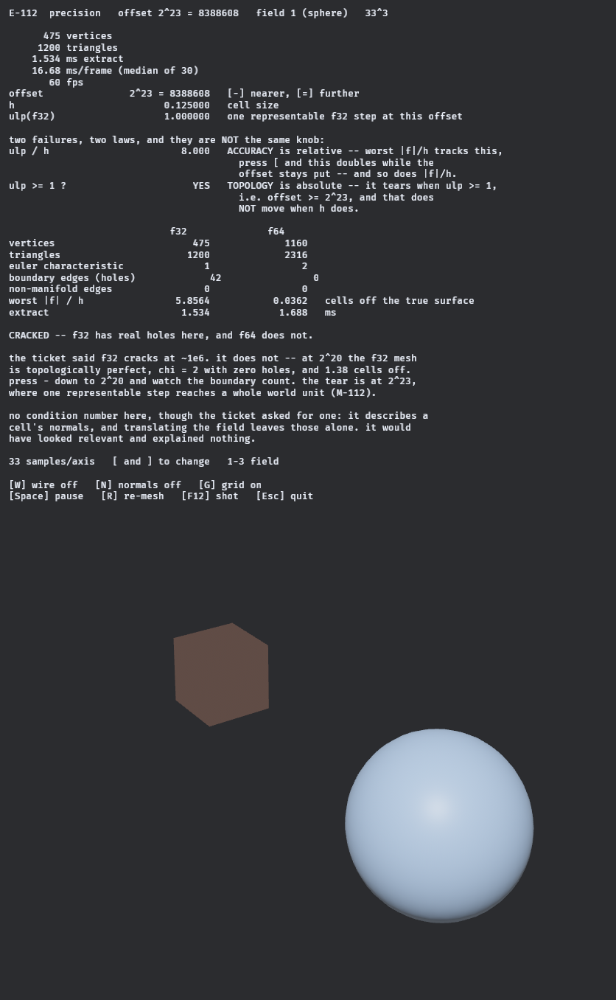
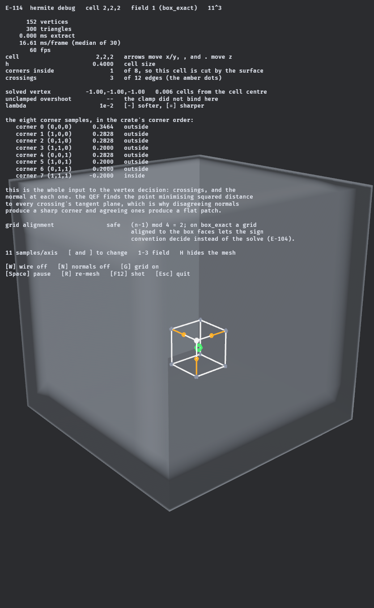

# Algorithm demos

Seven extractors, side by side, on the same fields and the same grids, in one process. That last part
is the point: most published comparisons are not comparisons at all, but one algorithm on one machine
against a number someone else measured on another.

Several figures here contradict what the literature says. Where they do, the contradiction *is* the
finding — `FINDINGS.md` records which source to distrust and why.

[← back to the README](../../README.md)

---

## Ninety-nine percent of a voxel grid is not surface


*`active_cells` — the cells a dual mesher must actually look at, drawn against the grid it must not. On
`sphere` the active fraction falls **3.54% → 1.89% → 0.93%** as the grid goes 33 → 64 → 128, while the
absolute count rises. That ratio falling is the entire justification for the mechanism.*

A dual mesher used to gather eight corners and count insides for **every** cell, then throw away 97% of
that work. The active-cell test is really one bit per sample: pack `value < 0` into a `u64` along `x`,
and one fused expression over the four rows bounding a cell row decides sixty-four cells at once —
`any = OR(w | w>>1)`, `all = AND(w & w>>1)`, `active = any & !all`. The strip in the HUD shows a real
row's word and its three fused results, so you can watch sixty-four cells being decided in one
operation.

**The honest number is a count, not a stopwatch.** M-348 falsified the original wall-clock claim — the
ratio read 1.336×, 1.192× or 1.022× depending on who else was using the machine. What the mechanism
actually does is *remove gathers*, and that is an integer: at 128³ it removes **99.07%** of them on
`sphere`, 98.35% on `fbm_terrain`, 95.85% on `gyroid`, identically on every machine (M-349). The demo
times both predicates live and shows the ratio, and also asserts the two produce the **same ordered
list** — an order difference would change every vertex index downstream.

**One line on screen exists to stop a future shortcut.** The bit is `value < 0`, not the IEEE sign bit.
`-0.0` has the sign bit set while `-0.0 < 0.0` is false, so a sign-bit build would be faster, would pass
every timing clause, and would change a reference field's mesh. `box_exact` is selectable so the caution
is not abstract.

```bash
cd bevy_isomesh && cargo run --example active_cells --release
```

`3`/`5` field · `[` `]` resolution · `.` step the cursor row · `H` surface on/off · `Space` pause.

---

## Marching Cubes, resolution sweeping


*Marching Cubes over a sphere SDF, resolution sweeping from 9³ to 81³. The readout is not decoration —
it is the crate's own validity harness, re-run on the mesh being displayed every time it changes.
`χ = 2`, zero non-manifold edges, zero boundary edges, every frame.*

```bash
cd bevy_isomesh && cargo run --example marching_cubes_sphere --release
```

---

## What it looks like

```rust
use isomesh::{MeshBuffer, RuntimeShape3};
use isomesh::fields::Sphere;
use isomesh::mc::MarchingCubes;

let mut mc = MarchingCubes::<f32>::new();   // owns its scratch; reuse across chunks
let mut out = MeshBuffer::<f32>::new();     // caller-provided; reset() keeps capacity

let shape = RuntimeShape3::new([33; 3])?;
mc.extract(&Sphere::canonical(), &shape, [-2.0; 3], 0.125, &mut out)?;
```

Anything implementing `Sdf` works as input; anything implementing `MeshSink` works as output. `bevy_isomesh::MeshBuilder` is a sink whose buffers *are* a Bevy `Mesh`'s attribute arrays, so extraction writes straight into the asset with no intermediate copy.

---

---

## Two algorithms, side by side


*Marching Cubes (grey) and Surface Nets (tan) on the same box SDF at the same resolution, sweeping 9³ to 57³.*

Watch the bottom row. **The triangle counts differ by exactly `2χ` — four, on a genus-0 surface — at every resolution.** That is not a coincidence and it contradicts both this project's own brief and the usual folklore that Surface Nets is the cheaper method by output size:

> Marching Cubes places one vertex per crossed grid edge, so `V_mc = C`. Surface Nets emits two triangles per crossed grid edge, so `F_sn = 2C`. Every closed triangulated surface obeys `F = 2V − 2χ`. Therefore `F_sn = F_mc + 2χ`, always. (A-015 gave some cells an extra interior vertex to keep the mesh manifold; it is measured never to fire under plain Marching Cubes, so `V_mc = C` still holds exactly.)

Verified across five fields × three resolutions, including a two-component field where `χ = 4` so the difference is **8** and cannot be confused with a constant. What Surface Nets actually buys is quad connectivity and one vertex per *cell* rather than per *edge* — not fewer triangles.

And it is not the cheaper method by time either, which took a benchmark to find out. The two curves are not parallel — one converges and the other degrades:

| samples per axis | 16 | 48 | 64 | 128 | 256 |
|---|---:|---:|---:|---:|---:|
| Surface Nets / Marching Cubes — **Apple M5** | 0.34 | 0.74 | 1.06 | 1.94 | **2.65** |
| Surface Nets / Marching Cubes — **Ryzen 9 5900X** | 2.46 | 3.06 | 3.36 | 4.16 | **3.72** |

Surface Nets loses, and it loses on both machines — **run on two, not one**. What does *not* transfer is the shape. On the M5 Surface Nets wins below roughly 48³ because Marching Cubes' per-sample cost starts at 25 ns and falls to 4.78 as the `O(n²)` surface term amortises away; on Zen 3 that fall never happens — Marching Cubes is flat at 13–15 ns from 16³ up — so Surface Nets is behind at **every** resolution measured and there is no crossover at all. Surface Nets' per-sample cost climbs on both (8.4 → 12.7 ns on the M5, 37.4 → 49.1 on Zen 3), which is what makes the verdict an algorithm property rather than one cache hierarchy. Sphere, f32, single thread. Raw data in `docs/measurements/resolution_sweep.csv` and `resolution_sweep-ryzen9-5900x.csv`.

So both halves of the usual case for Surface Nets — fewer triangles, lower cost — are falsified by measurement in this repository. What it actually buys is quad connectivity and one vertex per cell.


*`dual_contouring_cube` — the same box, the same 19³ grid, the same edge crossings. Surface Nets on the left, Dual Contouring on the right. The only difference between the two meshes is one function: where a cell's vertex goes. Both emit **972 triangles** with identical connectivity. On [`csg_difference`](../screenshots/e104-dual-contouring-csg.png) the concave seam holds too.*

The corners are the real difference, and dual contouring is what closes them. Measured on `box_exact` at 27³ — a resolution deliberately **not** aligned to the box faces, since on an aligned grid this measures the sign-classification rule rather than the algorithm:

| nearest vertex to the corner `(1,1,1)` | world | cells |
|---|---:|---:|
| Surface Nets | 0.0888 | **0.58** |
| Dual Contouring | 0.0009 | **0.01** |

Guaranteed intersection-free extraction turns out to be free *for placement*, and not sufficient overall — which is not what the folklore predicts in either direction. Confining each solved vertex to its own cell drives self-intersections to **exactly zero** on five of the eight test fields — `torus` goes 2.66 → 0 pairs per 1,000 triangles — and the corner above measures **identically** clamped or not, because a convex corner's solution is already inside its cell. What survives the clamp is 3.12 on the gyroid and 13.84 on fbm terrain, and those are precisely the two fields where two sheets of surface share a cell: a connectivity defect, not a placement one.

It costs about **3%** over Surface Nets to do it, and the two meshes are otherwise the same mesh: identical index buffers, and 864 of 1016 vertices agreeing to within `2e-15` cells. Only the 152 on edges and corners move.

---

---

## Letters thinner than a voxel


*One field, one grid, two extractors, and a sweep driving the letters from 1.6 voxels thick down to 0.2.
On the left, Marching Cubes: first a holey remnant, then **nothing at all**. On the right, subgrid
Marching Tetrahedra, unchanged.*



*The same thing standing still, with the numbers. The letters are **0.35 voxels thick**. Marching Cubes returns **0 triangles**; subgrid marching tetrahedra returns **1,340**.*

Every other method here asks one question per grid edge — *what sign is this endpoint* — and gets one bit back. A feature thinner than a cell fits between the samples and there is no answer that could describe it. **M-67** puts a number on the gap: a sign test cannot distinguish **95.6%** of the configurations a tetrahedron can actually be in.

Subgrid marching asks instead for **every zero along the edge**, and triangulates whatever comes back — however many crossings there are. Push the thickness up and Marching Cubes does not recover cleanly; it passes through a holey remnant first (220 triangles at 0.70 voxels), which is **M-72**'s aliasing and the failure mode a streamed world actually suffers. A feature that vanishes at a known distance can be faded. One that disintegrates into a resolution-dependent scatter pops.

It is not free: **M-98** measured it at **70× classic Marching Tetrahedra**, and the constant is field evaluations rather than anything algorithmic — 576 per cell at 16 samples per edge against Marching Cubes' 8 shared corner samples. But the comparison the HUD invites is the wrong one. The right one is *"against whatever grid resolution would resolve the same feature"*, and below one voxel there is none.

```bash
cd bevy_isomesh && cargo run --example subgrid_features --release
```

`-` `=` thickness · `[` `]` resolution · `W` wireframe.

---

## Seven algorithms, one process, one run

No paper since 2020 benchmarks Marching Cubes against Surface Nets against Dual Contouring, and Surface Nets has no credible published timings at all. So they are measured here — eight fields, two grids, seven algorithms, one process — and the headline is not what the folklore says.

**The timings moved by 4.26× on 2026-08-16 and the numbers below do not include it.** Two
optimisations — a `const`-generic loop axis and an odd sample row stride — took Surface Nets at 256³
from 693.8 ms to **162.7 ms** and its IPC from 1.20 to **4.09**, without changing a triangle. The
`SN/MC` ratio went from 5.43× to **1.26×**, and Surface Nets is now *faster* than Marching Cubes at
16³, 24³ and 32³. See [the experiments page](../experiments.md#the-426-and-not-one-triangle-changed);
`docs/measurements/family.csv` is the current run.

Correctness is unaffected — that is what "not one triangle changed" means — so the table below stands:

| | manifold | intersection-free |
|---|---|---|
| Marching Cubes | ✅ | ✅ |
| Marching Cubes + decider | ✅ | ✅ |
| Marching Tetrahedra | ✅ | ❌ 3.405 / 1k on `csg_difference` |
| Surface Nets | ❌ 128 edges | ✅ |
| Dual Contouring | ❌ 128 edges | ❌ 13.837 / 1k on `fbm_terrain` |
| **Manifold Dual Contouring** | ✅ | ❌ 15.434 / 1k on `fbm_terrain` |

Three of the four corners of that 2×2 are occupied, and **the crude baseline holds the good one**. What Dual Contouring buys instead is accuracy exactly where the features are sharp — symmetric Hausdorff at 65³ against Marching Cubes: `box_exact` **101×** better, `thin_plate` **77.9×**, against `sphere` **1.2×** and `torus` **1.6×**. Two orders of magnitude on a corner and nothing at all on a sphere.



*`marching_tetrahedra` — one sphere, one 17³ grid, two algorithms. 270 vertices against 830, 536 triangles against 1,656. The wireframe is on by default because that is the only place the difference lives.*

Marching Tetrahedra costs **2.87–3.91×** the triangles — the published "2–3×" covers only the two roughest fields — for **4.3%** worse geometry, where the source it is usually attributed to reads far stronger than that. And it is *better* than Marching Cubes on sharp fields, because its extra edge families sample a corner from more directions.

```bash
cargo bench --bench shootout        # writes docs/measurements/shootout.csv
```

---

## The blocky path, and a published number that is one scene's



*`greedy_quads` — the same fBm terrain and the same occupancy, meshed twice. Left, one quad per visible cell face: **5,014 quads**. Right, coplanar runs merged: **1,089**, and that side wall is two triangles. The wireframe is the demo, because the two surfaces are identical.*

Greedy meshing is quoted everywhere as **2.76× fewer triangles than face culling**, from one UE5 benchmark. Measured across eight fields at one resolution, it is not a constant:

| `gyroid` | `sphere` | `torus` | `fbm_terrain` | `csg_difference` | `box_exact` |
|---|---|---|---|---|---|
| 1.70× | 1.94× | 2.69× | 4.60× | 10.64× | **256×** |

Merging pays for **flat runs**. A grid-aligned box collapses to six quads at every resolution — twelve triangles at 17³, 33³ and 65³ alike — while a sphere's staircase is short runs and barely merges. The published figure happens to land beside `torus`. This was predicted before the measurement, for exactly that reason.

Two limitations are on display rather than hidden. `thin_plate` returns **zero triangles**: it is 0.4 cells thick and this algorithm asks one question per cell, so a feature thinner than a cell does not exist to it. And the mesh is deliberately **open** — a cube corner needs three normals, so vertices are split, and welding closes it everywhere except a T-junction, where a long quad butts against several short ones and the vertex they meet at simply is not on the long quad's edge.

```bash
cd bevy_isomesh && cargo run --example greedy_quads --release
```

`1`–`6` field · `[` `]` resolution. Press `2` then `]` to watch the right panel stay at twelve triangles while the left one grows.

---

---

## The sharpness knob, and what it costs at both ends


*`sharp_features` — one model, a live slider on **λ**, the Tikhonov regularizer in the vertex solve. It
is the whole sharpness/stability trade in one number, and it was a compile-time constant until this
demo needed to turn it.*

Toward **zero** the solve is the unregularized plane intersection: a corner where three planes meet
comes out exactly, which is the entire reason to run Dual Contouring rather than Surface Nets. But a
*flat* cell has a rank-1 system, nothing determines its vertex along two directions, and with no
regularizer holding it, it leaves. Toward **large**, every vertex is pulled to the centroid of its
crossings, nothing flies anywhere, and every sharp edge rounds over.

On `gyroid` at 25³ with the clamp off, sweeping λ over six decades:

| λ | worst \|f\| / h | worst clamp move |
|---|---|---|
| `1e-6` | 10.54 | **18.03 cells** |
| `7e-5` | 3.38 | 8.99 |
| `4e-3` | 2.24 | 3.41 |
| `5e-1` | 0.60 | 0.78 |

**Two numbers, because the two failures are not the same failure and one metric cannot see both.**
`|f|/h` is blind to the runaway exactly where it matters: a flat cell's unconstrained directions lie
*within* the surface, so an unheld vertex slides along the plane and stays on it. On `box_exact` at
λ = `1e-6` it reads **0.000** — a perfect-looking mesh with a vertex several cells from where it
belongs.

And the field matters as much as the metric. That same `box_exact` sweep gives **0.000 runaway at every
λ**, because M-30 measured this failure on `gyroid` and `fbm_terrain` and said plainly that *"sphere,
box_exact and thin_plate have zero vertices outside"*. Press `3` for the field that shows it (M-107).

The clamp is off by default here and *only* here: A-009's cell clamp confines every vertex to its own
cell, so with it on none of this is visible. That is why it is the crate's default.

```bash
cd bevy_isomesh && cargo run --example sharp_features --release
```

`-` `=` λ · `C` clamp · `1`–`4` field · `[` `]` resolution.

---

## What the clamp removes, and the half it cannot reach



*Every red outline is a triangle the self-intersection counter caught folding through another one. Same
mesh, same λ; the only thing that changes below is whether each vertex is confined to its own cell.*

The clamp is the cheapest correctness win in the crate and it is **not** a complete one, which is the
whole content of this demo. On the capped gyroid at 33³:

| | clamp off | clamp on |
|---|---:|---:|
| dual contouring | 71.429 | **3.118** |
| manifold dual contouring | 41.383 | **5.669** |

Pairs per 1,000 triangles. The clamp removes **95.6%** of them and leaves 3.118 — and what it leaves is
not a smaller version of the same problem. Five of the eight reference fields go to *exactly* zero;
`torus` reads 2.66 → 0. The two that don't are `gyroid` and `fbm_terrain`, which are precisely the
fields with cells carrying two sheets of surface. That residue is a **connectivity** defect, and no
constraint on where a vertex sits can reach it.

Press `A` for the part that is genuinely counter-intuitive. Splitting the shared vertex is the obvious
fix, and Manifold Dual Contouring makes the count **worse** — 3.118 → 5.669, 1.82×. The clamp's
guarantee assumes one vertex per cell, and two vertices in one cell is exactly the assumption being
dropped.

**Two things the picture is not claiming.** The counter never compares triangles that share a vertex
index, and dual contouring's quads share vertices across every cell face — 71,748 pairs are skipped on
this mesh, against 756 found, so a fold pinching exactly at a shared vertex draws no red. And the red
outlines come from the validator's own `pairs`, mapped back through a rebuilt copy of its face filter
that refuses to draw at all if the two disagree; nothing here forms a second opinion about what counts
as an intersection.

Sweeping resolution splits the two fields apart, which was not the prediction. On `gyroid` the clamped
residue falls with finer cells, 7.14 at 17³ to 1.12 at 49³ — multi-sheet cells are a resolution effect,
so resolving them removes them. On `fbm_terrain` it does not move: 25.40 at 17³, 20.43 at 49³, wandering
without direction in between. fBm has detail at every scale, so refining the grid uncovers new sub-cell
features exactly as fast as it resolves the old ones.

```bash
cd bevy_isomesh && cargo run --example qef_clamp --release
```

`C` clamp · `A` algorithm · `I` red · `1`–`4` field · `[` `]` resolution.

---

## Two failures, two laws, and neither one is where you would guess



*The same unit sphere, the same grid, the same code — `f32` on the left, `f64` on the right, both
translated to `2²⁰ ≈ 1.05e6` and moved back for display. Identical topology: 1,160 vertices, 2,316
triangles, `χ = 2`, zero holes on both. The lumps are the entire difference.*

This is what "CAD needs `f64`" actually looks like, and it is **two** failures rather than one.

**Accuracy is relative.** The worst distance from a vertex to the true surface is set by
`ulp(offset)` — the gap between neighbouring `f32` values out there. Expressed in cells it is
`ulp/h`, so a *finer* grid is hurt more by the same offset. Measured at `2²⁰`: **1.3808 cells for
`f32` against 0.0362 for `f64`**, a 38× gap with the mesh still topologically perfect. At a fixed
offset, halving `h` **exactly doubles** the error in cells — 3.1010 → 6.2020, 4.0000 → 8.0000,
5.8564 → 11.7128 from 33³ to 65³.

**Topology is absolute.** Push out to `2²³ = 8,388,608`, where one representable step reaches a whole
world unit, and the mesh tears:



`χ` drops 2 → 1, the vertex count collapses 1,160 → 475, and **42 boundary edges** appear — real
holes. That threshold **does not move when the cell size does**, which is what makes it a different
law from the first. The proof is one fixture: at 65³ and `ulp/h = 8` the mesh is clean, while at 33³
and the *same* `ulp/h = 8` it is torn. Neither number predicts the other.

**The ticket for this demo was wrong, and measuring first is why the demo is not.** It asked for
`~1e6` offsets where "f32 cracks" — at 1e6 `f32` does not crack, as the first image shows. It also
asked for the QEF condition number in the HUD, which describes a cell's normals and is very nearly
unchanged by translating the field; it would have sat there looking relevant and explaining nothing.
Two other suspects were ruled out before anything was built: re-validating the same `f32` vertices
after recentring **in `f64`** gives bit-identical reports, so the holes are in the mesh and not in the
validator's lattice, and an analytic gradient changes nothing, so `Sdf::gradient`'s `|p|`-scaled step
is not involved (M-112, M-113).

```bash
cd bevy_isomesh && cargo run --example precision_f32_vs_f64 --release
```

`-` `=` offset · `[` `]` resolution · `1`–`3` field.

---

## What the vertex solve actually sees



*One cell at a corner of `box_exact`. Three amber dots are the edge crossings, the amber lines are the
surface normal at each, the green dot is where the QEF put the vertex — exactly on the box corner — and
the white box is the cell.*

Dual Contouring's input is not the field. It is **Hermite data**: where the surface crosses each of a
cell's twelve edges, and the normal at each of those points. Everything the vertex decision knows is in
that picture, which is why disagreeing normals produce a sharp corner and agreeing ones produce a flat
patch.

The demo picks the cell for you, and *how* it picks is the interesting part. The obvious score — the
cell whose unclamped solve sits furthest from its own centre — is M-30's quantity, and M-30 also records
that `box_exact` has **zero** vertices outside their cells. So on this demo's default field that score
is about 0.006 everywhere and the winner is chosen by floating-point noise. It landed on a corner
anyway, which is exactly how a broken heuristic survives review. The score is now normal disagreement,
`1 − |mean(normals)|`: zero on a flat patch, `0.42` on a box corner.

Two other things this example had to get right rather than assume. `HermiteCell::from_corners` is public
while the corner order it requires is private, so the example duplicates the layout and then **verifies
it against the crate at startup** — and that check is mutation-tested, because swapping x and y still
yields four crossings and would pass a check that only counted them. And the first draft defaulted to
13³, which is precisely E-104's grid-aligned trap for `box_exact`: the demo opened on the degenerate
case it exists to explain. The resolution step is now arithmetic that cannot land on one.

```bash
cd bevy_isomesh && cargo run --example hermite_debug --release
```

Arrows move the cell in x/y · `,` `.` in z · `-` `=` λ · `[` `]` resolution · `1`–`3` field.

---

## Where an algorithm breaks, measured rather than described


*The capped gyroid — triply periodic, high genus. Marching Cubes stays manifold here; Surface Nets does not.*

Surface Nets places exactly one vertex per cell. Where two sheets of the surface pass through the same cell they are forced to share it, and the result is non-manifold — **42 non-manifold edges at 25³** in the sequence above, against Marching Cubes' zero at every resolution in it. The literature review calls this dual contouring's *"actual structural defect"*. It is fixed below, and the fix has a cost that is also measured.

Notice that the Euler identity now reads **`!! differs`**. That is correct: the identity's precondition is a *closed manifold*, and Surface Nets' output here is not one. The condition under which the assertion should fail is recorded next to the assertion, so when it does fail nobody mistakes it for a regression.

This is the crate's actual pitch. Not "the meshes look right" — a wrong mesh looks right — but that every mesh is measured, the measurements are in the test suite, and the ones that contradict the documentation are written down.

---

---

[← back to the README](../../README.md)
