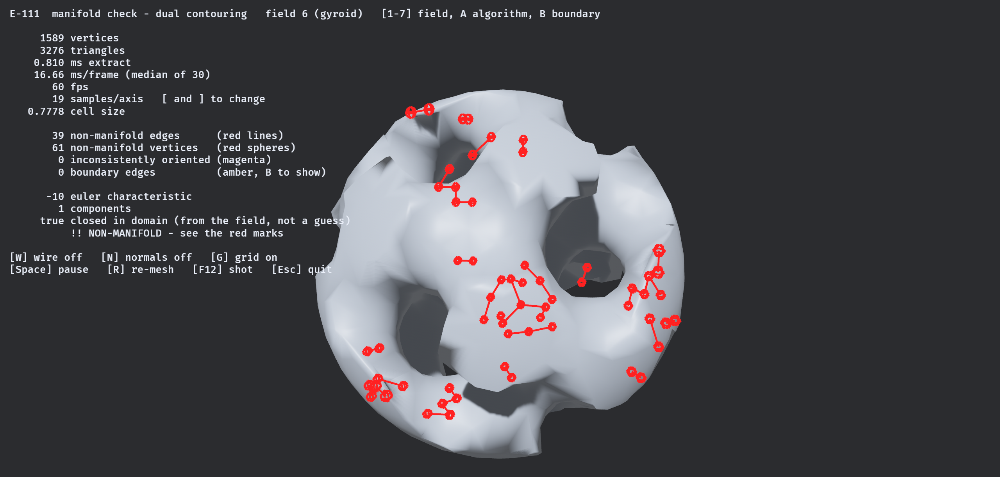
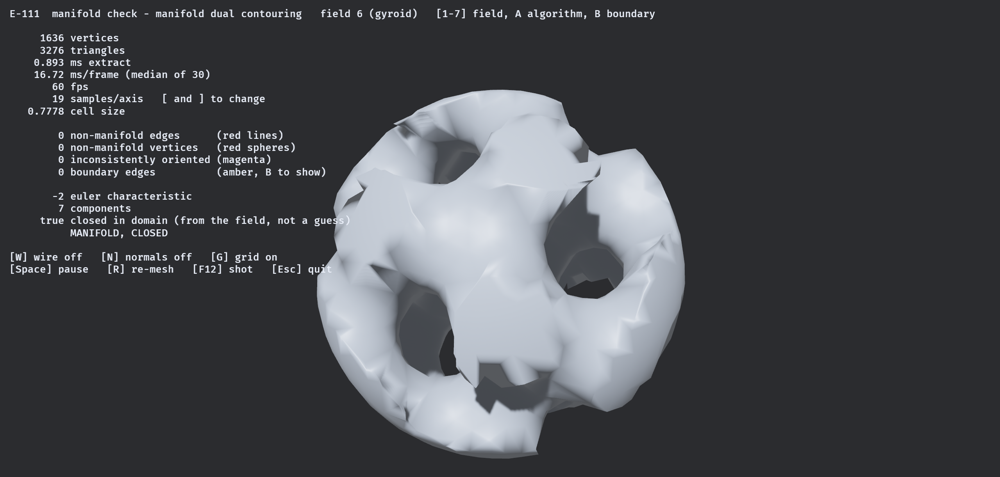
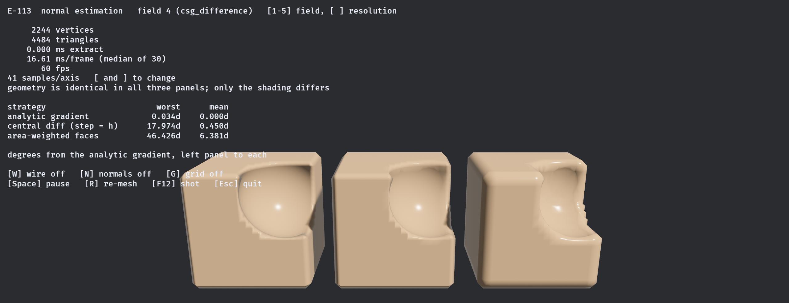
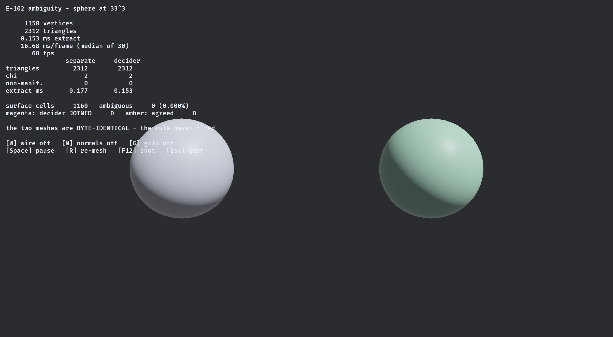
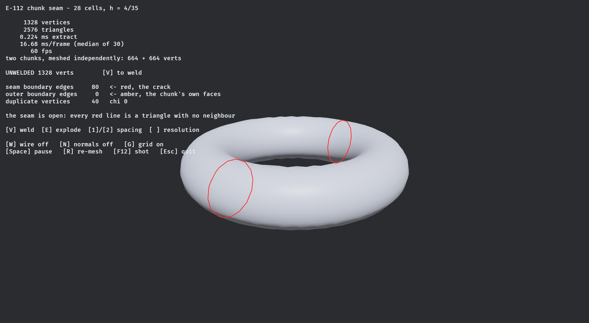
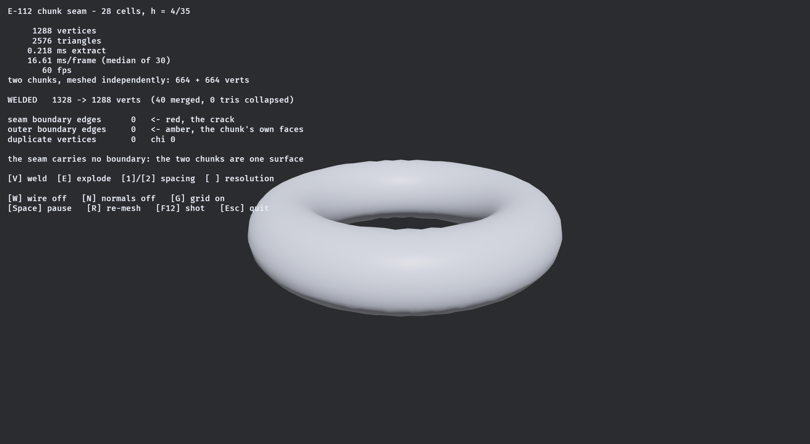

# Correctness demos

Where meshes stop being meshes. Non-manifold edges, inside-out triangles, ambiguous faces, cracks at a
seam — each shown with the count that makes it real rather than described in the abstract.

These are the least glamorous demos and the most load-bearing. A renderer forgives every defect on this
page. A physics engine forgives none of them.

[← back to the README](../../README.md)

---

## Mirroring an asset breaks mesh-hash dedup, and rotating it does not


*`game_mirror_dedup` — one chunk, `marching_cubes`, 33³ on the field's own symmetric domain. The scene
steps through all **48** signed coordinate permutations of the cubic lattice and, for each, re-meshes the
reoriented field and compares it bit-for-bit against the reference mesh mapped through the same element.
A marker is drawn on every vertex that moved.*

There are 48 ways to reorient a chunk on the cubic lattice: six axis permutations times eight sign
patterns. Every one of them is a *signed coordinate permutation*, which is exact in `f64` — it permutes
components and flips signs and does no arithmetic at all. So the natural expectation is that a mesher
commutes with all 48, bit-for-bit.

**Exactly six of the 48 do, and they are precisely the six that never negate a coordinate.**

| field | cut edges | order-sensitive | vertices moved | exact of 48 |
|---|---:|---:|---:|---:|
| `sphere` | 1,158 | 72 | **72** | 6 |
| `torus` | 1,128 | 152 | **152** | 6 |
| `csg_difference` | 1,386 | 50 | **50** | 6 |
| `thin_plate` | 510 | 450 | **450** | 24 |
| `gyroid` | 5,292 | 532 | **532** | 6 |
| `fbm_terrain` | 2,069 | 291 | **291** | 6 |
| `noise_cavity` | 6,522 | 643 | **643** | 6 |
| `box_exact` | 1,350 | **0** | **0** | **48** |

**The mechanism is closed rather than guessed, and the middle two columns are why.** "Order-sensitive
edges" is computed from the sample grid *before any extractor runs*: it counts cut edges where the crossing
computed from the far endpoint differs from the crossing computed from the near one, by a single bit. On
`marching_cubes` it equals the number of vertices that move **exactly**, on every field.

The reason is one line of the extractor. `EDGE_CORNERS` orients every grid edge along **increasing grid
index**, so `edge_position` always computes `t = a/(a−b)` from the lower-index corner and anchors the lerp
there. Negate an axis and the index order along it reverses: the extractor now computes `b/(b−a)` and
anchors at the other corner. Those two are `1 − t` and `t` in exact arithmetic and land on the same point
geometrically — and they are **not bit-reciprocal**, because two different divisions of the same two `f64`
round differently.

**So this is not a story about accumulation.** A primal vertex involves two values and no summation at
all, which is exactly why it *looks* safe. What matters is not how many values are combined but in which
order the two of them arrive.

**What a studio meets.** Mirroring an asset to reuse it is the oldest trick in level art, and it silently
defeats anything keyed on a content hash — GPU instancing, collision-mesh caching, a chunk mesh cache, a
network delta that ships "same as that one". Rotating the same asset by an axis permutation hits the cache
every time. Both copies look identical on screen, so nothing anywhere reports a problem; you simply pay
for two meshes and two collision bakes where you budgeted for one.

**`box_exact` is the control and it is the interesting row.** All 1,350 of its cut edges are
order-insensitive, because its zero set lies on coordinate planes that any dyadic grid hits exactly, so
`a/(a−b)` and `b/(b−a)` both land on an exactly representable coordinate. Mirroring it *is* bit-exact, on
all 48 elements. That is the shape of a fixture that cannot fail — and it is why the demo offers several
fields rather than one, since a demo that only ever showed `box_exact` would prove the opposite of the
truth.

`thin_plate` sits in between at 24 of 48: its surface lies on one coordinate plane and not the other two,
so flips of a single axis survive and the rest do not.

**The fix, named and not taken here.** Anchor the interpolation at a canonically ordered endpoint rather
than at the lower grid index and the primal case becomes equivariant on all 48. That is a change inside
`crates/isomesh/src` and it moves golden hashes, so it is a ticket rather than a demo.

```bash
cargo run --example game_mirror_dedup --release      # 1-8 pick the field, arrows step the element
```

Numbers reproduced live from `docs/experiments/p-57.csv` — eight fields × nine columns, all agreeing
(M-356 / ✗39, P-57, R-055). The full sweep is 112 rows over seven extractors, where the two tetrahedral
extractors fail even on `box_exact`: their six-tetrahedron cell decomposition is not octahedrally
invariant, which is a second mechanism entirely.

---

## The repair that fixes every triangle and welds 520 things shut


*`pinch_repair` — real `uint8` CT volumes at an integer isovalue. **Amber** marks a collapse group that is
a fold being flattened; **magenta** marks a **pinch** — two sheets of surface that merely meet at one
sample. `fuel` has **0 pinches of 50** groups. `bonsai` has **516 of 17,201**.*

Quantised data puts samples *exactly* on the isovalue — M-316 measured **16,284 of 529,508** `bonsai`
surface-cell corners doing it, 3%. When that happens the edge interpolation parameter `t = a/(a−b)` is
exactly 0 or 1, so the crossing lands **on** the sample, every cut edge meeting there does the same, and
the vertex cache is keyed on the grid edge rather than the point — so nothing is shared and the mesh
carries triangles with coincident corners. **Every** degenerate triangle traces to this: 164 of 164 on
`fuel`, **58,097 of 58,097** on `bonsai`, tagged by replaying the march rather than inferred.

The repair is to give the equal corner its own label and let all its crossings share one vertex. It works
perfectly — both volumes go to **zero** degenerate triangles — and `max_snap_distance` is **exactly 0**,
so **no geometry moves at all**. It is a pure connectivity decision.

**And that is exactly why it is dangerous.** On `bonsai` it changes χ from 517 to 585, creates 561
non-manifold edges, and **welds 520 previously separate components**. On `fuel` nothing moves. The
difference is decidable *before* the repair, by one union-find over the baseline mesh: two vertices
snapping to the same corner that **already share a triangle** are a fold, and safe; two that share **no**
triangle are different sheets, and identifying them is a topology change.

**So the shippable result is the precondition, not the repair** — and a crate that shipped the repair
unconditionally would silently weld a CT scan and pass every gate except the Euler characteristic
(M-352).

```bash
cd bevy_isomesh && cargo run --example pinch_repair --release
```

`1`–`2` volume · `B` baseline vs repaired · `W` wireframe · `Space` pause.

---

## An error bound that is not just respected but reached


*`seam_normal_bound` — a CSG `Difference` with the crease angle `θ` sweeping 30° → 175°. At each vertex
whose six-sample stencil crosses the seam, the central-difference normal and the analytic normal are drawn
as a pair. The meter tracks the measured worst error against the predicted `(180° − θ)/2`.*

At a `min`/`max` seam the field is `C⁰` and not `C¹`. A central difference straddling it averages two
different gradients, so the direction it returns lies in the cone the two branches span — and the error is
at most **half the angle between them**. It does **not** shrink with resolution, because the stencil step
scales with position, not with the grid.

**The bound is provable and it is attained.** The difference returns `u − Λw` for a *diagonal* `Λ` whose
entries are all `≤ ½`, which gives exactly `(180° − θ)/2`, with equality wherever a vertex lands on the
seam — which is what a QEF does by construction. Measured median tightness is **0.9748** over 24 rows, 9
of them above **0.99**: at 175° the worst error is **2.498°** against a 2.5° bound, at 120° **29.982**
against 30, at 90° **44.823** against 45.

Everywhere else the normals are effectively exact — non-straddling vertices average **6.75e-10 degrees**
of error, 1,480× inside the threshold. **The defect is not diffuse; it is a curve one cell wide**, and the
demo lets you watch the meter fill as the crease flattens (M-350).

This also closes an older loose end: P-47 found a single vertex in 57,470 carrying 4.365° and could not
explain it. It back-solves to a 171° seam against a 4.5° bound — a near-tight straddle, not an outlier.

```bash
cd bevy_isomesh && cargo run --example seam_normal_bound --release
```

`1`–`3` ledger rows · `N` normals · `W` wireframe · `Space` pause.

---


## Where a mesh stops being a manifold


*`manifold_check` — the capped gyroid at 19³ under Surface Nets. Every red sphere is a non-manifold vertex and every red line a non-manifold edge, drawn where the validator found them: 39 edges and 61 vertices, clustered around the tunnel mouths where two sheets of surface share a cell. The same field and grid under Marching Cubes reports `0` on every counter and `MANIFOLD, CLOSED` ([screenshot](../screenshots/e111-manifold-check-gyroid-marching-cubes.png)).*

A count tells you a mesh is broken without telling you where, and the two most useful findings in this project were both about *where*. The marks come from `validate_features`, which returns the offending edges and vertices from the **same pass** that produced the numbers beside them — so the picture and the caption cannot drift apart.

```bash
cd bevy_isomesh && cargo run --example manifold_check --release
```

`1`–`7` field · `A` algorithm · `B` boundary overlay · `[` `]` resolution.

---

## Counting the defects before the mesh exists


*`critical_cells` — `noise_cavity` at 65³. Cyan cages are 2D-critical cells, magenta are 3D-critical, yellow dots are the non-manifold vertices Dual Contouring actually produced. **567 + 35 = 602 critical cells, 602 non-manifold vertices, 602 critical cells hosting one, 100% co-location.** Cycle to `sphere` and every one of those numbers is zero.*

The dots are not *near* the cages. There is exactly one dot per cage, and that is the finding (M-338): a
cell is **critical** when its eight corner signs host one of Latecki's two configurations — a face whose
inside corners are diagonal, or an inside set that is a single main-diagonal pair — and the census of
those cells does not merely predict where a dual extractor will go non-manifold. It **counts** the
defects. `critical cells == non-manifold vertices == critical cells hosting one`, exactly, on all three
fields that have any.

What makes that useful is *when* it is available. The census is a function of the sign bytes alone, so it
can be taken **before** anything is extracted — 13.5 ms against 63 ms of extraction on the grid in the
capture — and the answer is the exact count of non-manifold vertices the mesh has not been built yet to
contain. The 256-entry classification is enumerated from the definitions at startup rather than
transcribed, and the example logs `120 2D-critical, 8 3D-critical, 0 in both` before it opens a window;
a transcribed table that disagreed would say so on the first line.

```bash
cd bevy_isomesh && cargo run --example critical_cells --release
```

`1`–`5` field · `F` fly to the densest cluster · `H` surface on/off.


---

## Splitting the vertex, and what it costs





*The same field, the same 19³ grid, one algorithm apart. **Dual Contouring: 39 non-manifold edges, 61 non-manifold vertices, `χ = -10`, one component.** **Manifold Dual Contouring: zero, zero, `χ = -2`, seven components** — and the same 3,276 triangles. Press `A` in `manifold_check` to switch between them.*

One vertex per cell is the defect. The fix is one vertex per **surface component**: the cell's cut edges are partitioned into the cycles the Marching Cubes table already links them into, and each cycle gets its own QEF solve. Ju's own paper describes it and credits it to Nielson — the output is the *dual* of the Marching Cubes surface, so it inherits Marching Cubes' topology.

That inheritance is asserted, not assumed. On every closed field at 17³, 25³ and 33³ the dual reproduces Marching Cubes' Euler characteristic **and its component count** exactly. Look again at the two captions: the pinch was not only breaking the index buffer, it was **fusing seven pieces into one and misreporting `χ` by eight**.

Three things this measured that were not what the tickets predicted:

- **The cost is zero on five of the seven fields**, and about **5%** of the run time on the other two. Only `gyroid` and `fbm_terrain` ever need a second vertex in a cell, and their rate *falls* with resolution — 3.13% → 2.05% → 0.53% at 17³/25³/33³. Nielson's published *"about 1.3%"* counts entries in the case table, not cells in a scene. Triangle counts are unchanged: splitting moves vertices without adding quads.
- **Self-intersections get worse, not better** — `gyroid` 3.118 → 5.669 per 1,000 triangles, `fbm_terrain` 13.837 → 15.434. The prediction registered before the run said the opposite. Two vertices in one cell is exactly what breaks the within-cell partition the clamp's guarantee rests on, and a 2024 result reporting Manifold Dual Contouring as 100% self-intersecting was on the record the whole time.
- **A second, unrelated non-manifold mechanism exists.** The dual of a manifold surface is a manifold *complex*, and an index buffer cannot hold two distinct edges between one pair of vertices, so parallel dual edges collapse into one edge with four faces. The property suite found it by shrinking to the exact same three-sphere fixture that falsified unconditional manifoldness for Marching Cubes. It is identified by arithmetic rather than by eye: a collapse costs exactly one edge, so `χ_dual − χ_mc == non_manifold_edges`, measured `1 − 0 == 1` at `h = 2/3` and `0 == 0` at every finer grid.

---

---

## Which way does the surface face

Three answers, and they are not the same answer. Ask the **field** for its gradient; **difference** the field, which is all a sampled voxel buffer can offer; or take the **area-weighted average of the incident triangles**, which is all a mesh can offer. `normals::recompute` re-derives a finished `MeshBuffer` under any of them, so the choice survives welding and merging instead of being baked in by whichever extractor ran.

Differencing at the cell size — the case a game without an analytic field is stuck with — costs under half a degree, and converges the way it must:

| grid | worst | mean |
|---|---|---|
| 17³ | 0.460° | 0.299° |
| 33³ | 0.121° | 0.079° |
| 65³ | 0.031° | 0.020° |

Successive ratios 3.76 and 3.92, so `h²`, asserted as a range rather than admired in a log.



*`normal_estimation` — a sphere bitten out of a box at 41³. **All three panels are the same 2,244 vertices and 4,484 triangles**; only the normal buffer differs. Left, the field's gradient keeps the bite's rim crisp and its staircase legible. Right, area-weighted normals smear that rim and round the steps into blobs — 46.426° off at the worst. The middle is differencing the field at the cell size, which is what a sampled voxel buffer can offer: 17.974° worst, and 0.450° on average.*

```bash
cd bevy_isomesh && cargo run --example normal_estimation --release
```

`1`–`5` field · `[` `]` resolution · `W` wireframe.

The third strategy is where it gets interesting. Area-weighted normals track the field closely on smooth geometry and **cannot** on sharp geometry, because a corner vertex gets the average of three face normals where the field's gradient gives one of them. On a sphere the mean disagreement falls 3.25° → 2.16° → 1.08° across those grids and on a torus 11.65° → 6.07° → 2.45°. On `box_exact` the *worst* disagreement is **35.796° at all three resolutions, identical to six figures** — refining a grid does not soften a corner. That invariance is the assertion; the constant is just the box's corner.

---

---

## An ambiguous face, and how rarely one turns up


*`marching_cubes_ambiguity` — plain Marching Cubes on the left, the same extraction with `FaceAmbiguity::AsymptoticDecider` on the right. Every box is a cell with an ambiguous face: **amber where the decider agreed and separated the corners, magenta where it disagreed and joined them.** Magenta is the only place the two meshes can differ, and on the gyroid at 33³ there are nine such cells out of 5,240.*

The catalog originally specified this example as "holes on the left, closed on the right". **That cannot be shown, because it does not happen** — this crate's case table is derived at compile time by walking each face counter-clockwise, so two cells sharing a face cannot disagree about it and neither side ever holes. What the decider changes is *which* surface gets built on an ambiguous face, which the HUD reads off as a difference in Euler characteristic.



*Press `3`. On a sphere there is **not one ambiguous face in 1,160 surface cells**, and the two meshes are byte-identical — which the committed golden fixture also pins. Five of the eight reference fields behave this way; only the gyroid (0.515% of cells) and `fbm_terrain` (1.532%) reach the configuration at all. An example that only ever showed the interesting case would misrepresent how often the interesting case arrives.*

```bash
cd bevy_isomesh && cargo run --example marching_cubes_ambiguity --release
```

`1`–`3` field · `A` cell markers · `[` `]` resolution.

---

---

## A weld that keeps the crease, and one that does not

```bash
cargo run --example weld_creases --release
```

Two cubes, same input, same tolerance. The left one is welded on **position alone**: its eight corners
swallow all 24 vertices, the six faces end up sharing normals, and the flat shading that made it read
as a cube is gone. The right one is welded with a key built from the vertex normals, keeps all 24, and
still looks like a cube.

**Neither is a bug.** The left weld did exactly what "merge coincident vertices" means. It is just that
merging coincident vertices and preserving a crease are different requests, and only the caller knows
which one it wants — so `Welder::weld_split_by` takes the key rather than guessing.

### Why the key is a quantum and not a smoothing angle

The conventional test is *"merge if the normals are within 30°"*, and this crate deliberately does not
offer it. **An angle threshold is not transitive**: `a` within 30° of `b` and `b` within 30° of `c`
does not put `a` within 30° of `c`. So it is not an equivalence relation, and applied to a `k`-way
coincidence class it merges some members and refuses others — leaving the leftover representative a
bowtie. This repository measured that exact shape adding **up to 791 non-manifold vertices**, taking
`noise_cavity` from 301 to 1,092 and `sphere` + Marching Cubes from 0 to 96 (E×4).

Quantising to a lattice *is* transitive, so a class always splits into complete sub-classes. Its
failure mode is a **missed merge** at a bucket boundary — a visible seam, harmless topologically —
which is the right failure to prefer over a manufactured bowtie.

### The number that surprises people

The key-welded cube reports **24 boundary edges** where the position-welded one reports none. That is
not damage: keeping six faces apart necessarily opens the edges between them, so the split mesh is a
**surface**, not a solid. Its open edges are a recorded number rather than a failure, and
`SurfaceGate::Manifold` is how you say so — asserting `Closed` on it would report correct output as
broken (M-305).

Which makes this the mirror of E×4. There a *pairwise* refusal did its damage in the **vertex** column;
here an *equivalence* refusal does its intended work in the **boundary-edge** column. The column that
moves tells you which kind of refusal you built.

---

## A crack between two chunks, and welding it shut



*`chunk_seam_weld` — one torus, two chunks, meshed **independently**, exactly as a game does when an edit dirties only the chunks it touches. Every red line is a boundary edge on the shared plane: a triangle with no neighbour. `80` of them, and `40` duplicated vertices. The surface looks continuous and is not.*



*The same two chunks after `V`. **`1328 → 1288` vertices, 40 merged, 0 triangles collapsed, and the seam carries no boundary at all.** χ stays `0` — it is a torus either way; what changed is that it is now one surface.*

The spacing selector is the part worth pressing. `1` is `h = 0.125` and `2` is `h = 4/35`, and only one of those is arbitrary: two chunks agree on their shared sample plane bit-for-bit **only when the cell size is a power of two**, because one computes `(o + h·cn) + h·n` and the other `o + h·(c+1)n` — equal by algebra, not by IEEE. 22% of random `(origin, h, cells, chunk)` combinations disagree by an ulp, and `4/35` came out of that search. A weld keyed on exact equality closes the seam under `1` and silently leaves it open under `2`; this one is an epsilon weld for exactly that reason.

```bash
cd bevy_isomesh && cargo run --example chunk_seam_weld --release
```

`V` weld · `E` explode the chunks apart · `1` `2` spacing · `[` `]` resolution.

---

---

[← back to the README](../../README.md)
