# Gameplay demos

The examples that use the crate the way a game does: chunked, edited, streamed, budgeted and collided
against. These are the ones that decide whether the crate is usable, because a meshing library that
produces a beautiful sphere and falls apart at a chunk seam is not one you can ship.

Every figure here came from a command you can run, and the command is under each demo.

---

## A world with a roof over your head

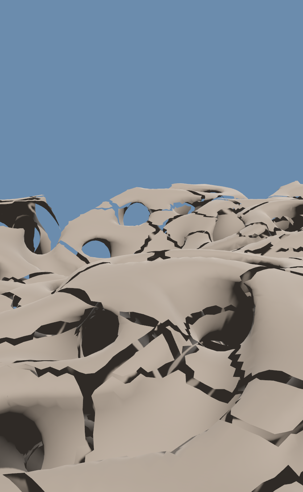

*Streamed, meshed while the camera moves, and flown **through** rather than over. 440,000 triangles,
376 chunks, 60 fps.*

Every other demo on this page runs on `fbm_terrain`, which is a **heightfield** — one height per
column, no overhangs, no caves, nothing above anything else. That is a good test field and a bad
advertisement, because a heightfield is precisely the case you do *not* need a voxel mesher for.

This one composes a field that has no height at all:

```text
solid(p) = max( p.y − height(x, z) ,  |gyroid(p)| − thickness )
```

The gyroid tunnels in all three axes, so intersecting it with the space under a terrain surface leaves
caves that connect, arches, and rock overhead. Press `1`, `2`, `3` to thin or thicken the shell.

**It is meshed with Marching Cubes, and that is not a preference.** The world is chunked, and the dual
methods do not tile across a chunk boundary: Marching Cubes puts vertices on grid *edges*, which two
neighbouring chunks compute identically, while Surface Nets and Dual Contouring put one vertex per cell
*interior* and a boundary quad needs the neighbour's vertex. Measured on two adjacent chunks, boundary
edges in the shared plane: **Marching Cubes 0, Surface Nets 5, Dual Contouring 4** — and 0 for Marching
Cubes on every field tried, while the dual methods are 0 on some and open on others, so what they lack
is the guarantee rather than the geometry on any one frame. This demo shipped on
Dual Contouring for exactly one commit and the GIF above was a torn, slashed mess until someone looked
at it (M-128).

Two other things worth knowing about how it got there. The gyroid's period **is** the look — the first
attempt used `K = 0.19`, a 33 m period, where one tunnel is wider than the view and the world reads as
a cracked plain rather than as caves. And the staircasing along the rim where the two surfaces meet
turned out to be the **field's** aliasing, not the extractor's: swapping Surface Nets for Dual
Contouring changed nothing, and what fixed it was a smooth intersection plus a shell thick enough to
clear the sampling limit — 2.2 cells to 3.4. That is M-72's failure mode arriving by composition
instead of by resolution.

```bash
cd bevy_isomesh && cargo run --example game_showcase --release
```

`Space` pause · `[` `]` fly speed · `1`–`3` cave density.

---

## A body that slides, not a ray that hits

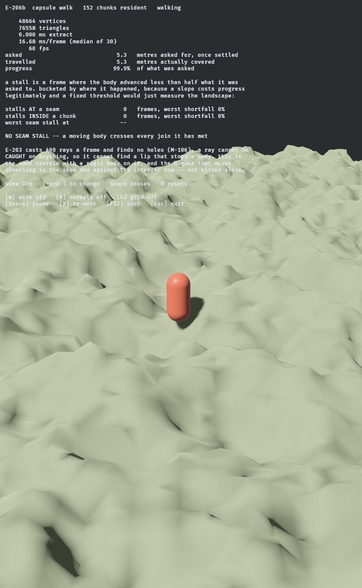

*The same streamed `fbm_terrain` `game_walk` crosses, with an actual rigid body on it. 154 chunks
resident, 77,492 triangles, 60 fps, and the collider handed to the physics engine is built from the very
`Handle<Mesh>` the renderer is drawing.*

`game_walk` casts 400 rays a frame and finds no holes — 495 seam crossings, zero misses. What it cannot
find is a lip that **stops** something, because a ray is never *caught* on anything. A 0.2-unit step at a
seam is, to a moving capsule, either nothing at all or a wall, and which one depends on the capsule, its
speed and the angle it arrives at.

So this drives a dynamic capsule at 7 m/s along the same path and measures what it is prevented from
doing. Over 66 seconds and 441 metres:

| | |
|---|---|
| commanded distance actually covered | **97.0%** |
| stall frames **at a seam** | **13** |
| stall frames **inside one chunk** | **70** |
| worst single-frame shortfall **at a seam** | **0.809** |
| worst single-frame shortfall **inside one chunk** | **1.000** |

The interior of a chunk stalls a moving body **five times as often** as a join does, and stops it dead at
least once where no seam ever did. That is the same verdict the ray sweep reached from the other side —
the joins are smoother than the terrain they join — reached by the one test that could have disagreed.

The body is **dynamic**, not kinematic, and that is the design rather than a detail: a kinematic capsule
is moved by writing its transform, so it decides where it ends up and the terrain never gets to refuse.
Only a dynamic body can be stopped by geometry, and being stopped is the measurement.

```bash
cd bevy_isomesh && cargo run --example game_capsule_walk --release
```

`Space` pause · `[` `]` view distance · `R` reset.

---

## Shoot it, and the debris is the boolean

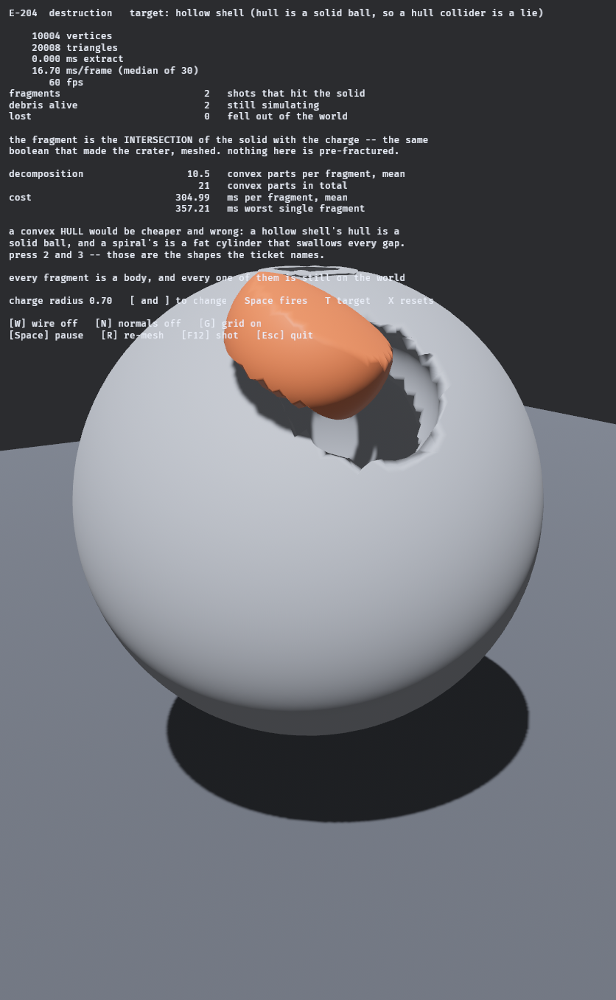

*A hollow shell with a hole blown in it. The orange fragment is not a prop — it is the **intersection**
of the shell with the charge, meshed. The crater and the fragment are two views of one boolean, and you
can see straight through to the cavity that a convex hull would have filled in.*

The cheap version of this demo pre-fractures a wall at build time and hides the pieces until you shoot.
That proves nothing about a meshing crate. Here a shot appends `Brush::subtract(sphere)` to the solid's
edit log and meshes the intersection of the solid-before-the-shot with that same sphere. Nothing is
authored.

Fragments get a **convex decomposition**, not a hull, because both shapes this demo targets defeat a
hull: a hollow shell's hull is a solid ball, and a spiral's is a fat cylinder that swallows every gap.
The cost of that correctness is the number worth publishing:

| target | fragments | convex parts | parts per fragment | mean | worst |
|---|---:|---:|---:|---:|---:|
| wall | 23 | 211 | 9.2 | **240.7 ms** | 323.7 ms |
| hollow shell | 24 | 305 | **12.7** | **271.8 ms** | 369.0 ms |
| spiral | 23 | 224 | 9.7 | **249.0 ms** | 362.6 ms |

A 60 fps frame is 16.7 ms. **One fragment's decomposition is fourteen to twenty-two whole frames**, and
it lands on the frame the shot does. Zero fragments failed to get a collider on any target, and the
shell — the shape whose hull is a lie — needs the most pieces, exactly as predicted.

So correct destruction colliders are achievable and must never be synchronous. This belongs on a worker
with the finished collider swapped in later, which is how G-006 already treats meshing.

One honest number: **1 of 23** wall fragments still goes through the floor, and 0 of the shell's and
spiral's. That is reported rather than tuned away. An earlier version of this demo accused *15 of 23* of
tunnelling — and the scene simply had no floor for them to land on.

```bash
cd bevy_isomesh && cargo run --example game_destruction --release
```

`Space` fire · `[` `]` charge radius · `T` target · `X` reset.

---

## Flying an LOD ladder, and counting what opens up

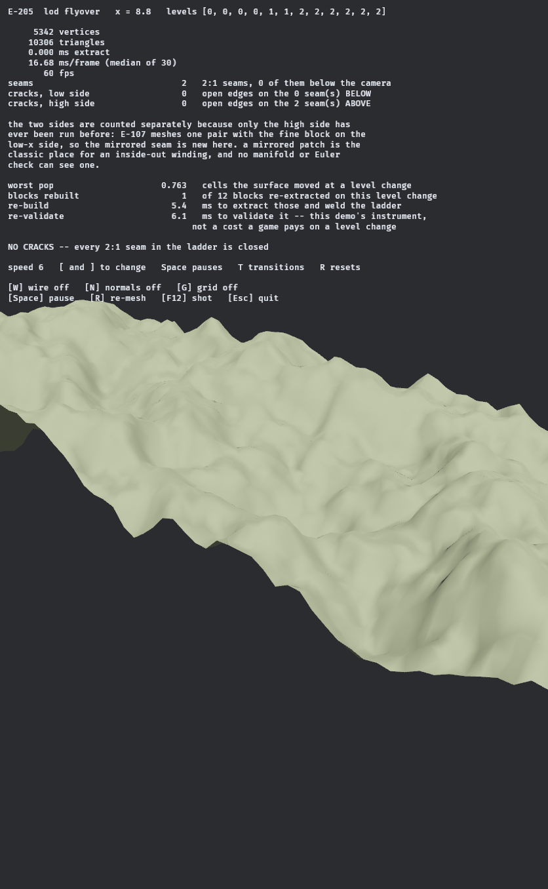

*Twelve blocks stacked along `x`, each meshed at its own spacing — levels 0, 1 and 2, so 0.25, 0.5 and
1.0 world units — with the camera flying out along the ladder and back. Every 2:1 seam is bridged by
Transvoxel transition cells, and the count of open edges lying in a seam plane is on the HUD.*

Three claims, three measurements, and only one of them came out the way the ticket phrased it.

**No cracks — confirmed, and on a configuration that had never run.** `transvoxel_seams` meshes exactly
one pair of blocks with the fine one on the low-`x` side, so `inset_boundary` had only ever been called
with `face_bit(0, 0)`. Flying out *and back* puts coarse blocks on both sides of the camera, so half the
seams here are the mirror image — and a mirrored patch is the classic place for an inside-out winding,
which no manifold or Euler check can see. Across the whole flight: **0 open edges on both sides**.

That zero is only worth something because it can fail. With transitions off, the same worlds report
**71 open edges on the low side and 102–111 on the high side**:

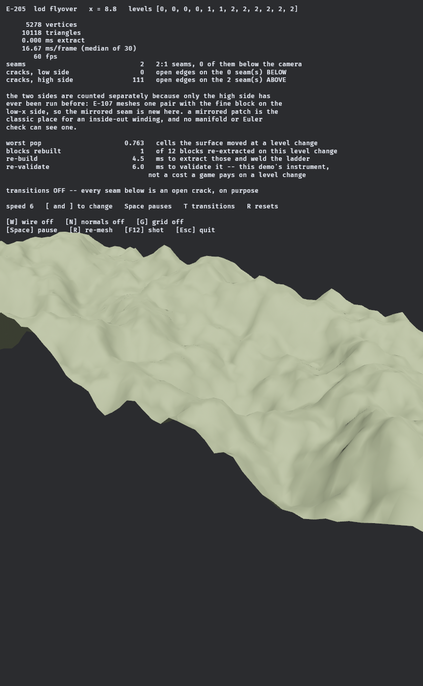

**"No popping" is the wrong claim.** A coarser mesh genuinely *is* a different surface, so the honest
deliverable is the size of the jump, not a denial that it happens. Meshing a block at both its old and
new level at the instant it switches: **worst 3.136 cells**, typically 0.6–1.6. That number decides
whether a fade can hide it, and there is no figure for it anywhere in the literature review.

**No hitching — but only after the naive version was fixed.** Re-extracting all twelve blocks whenever
any one changes level costs **12–23 ms** and misses the frame. Caching each block's *un-inset*
extraction and rebuilding only the one or two that actually changed takes it to **4.6–12.4 ms**. What
has to be cached is the extraction *before* the taper, because `inset_boundary` mutates positions in
place and which faces need it depends on the neighbours' levels.

The ladder runs along one axis on purpose: every seam is an `x` seam, so a crack has no second axis to
hide behind. A production terrain needs four faces, or six with caves, and this does not show that.

```bash
cd bevy_isomesh && cargo run --example game_lod_flyover --release
```

`Space` pause · `T` transitions on/off · `[` `]` speed · `R` reset.

---

## 288 chunks re-meshed, without missing a frame

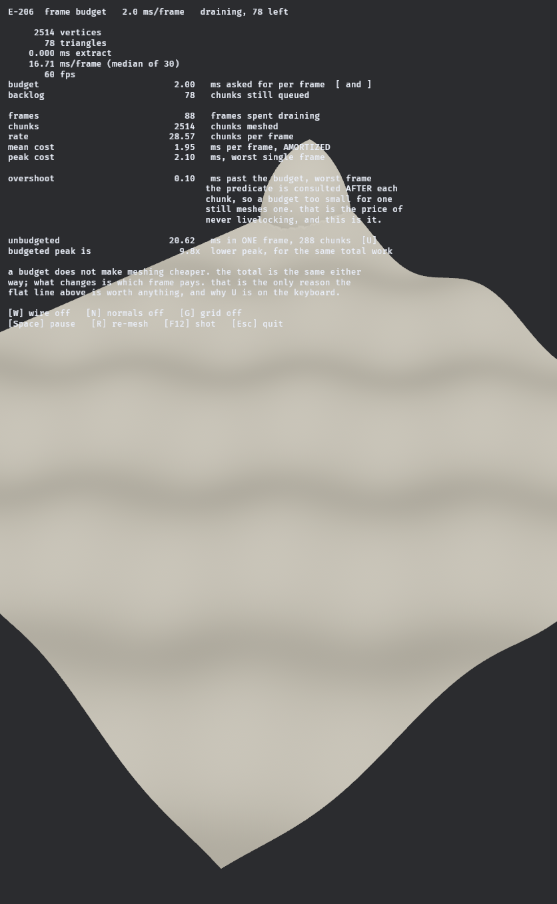

*Every chunk in the world dirty at once, and the queue re-fills the instant it empties. 28.6 chunks a
frame at a 2 ms budget, 60 fps throughout.*

A meshing paper reports throughput — chunks per second, milliseconds for a grid. A game cannot spend
that, because it does not get a second. It gets 16.7 milliseconds and then it has to draw something.
The question is not how fast the queue drains but **what it costs the frame it lands on**.

The flat line is worth nothing without the version that spikes, so `U` drains the identical queue
through `mesh_dirty`, which does all of it now:

| | |
|---|---|
| unbudgeted, one frame | **20.62 ms** — misses a 16.7 ms frame |
| budgeted, worst frame | **2.10 ms** |
| lower peak, same total work | **9.8×** |

A budget does not make meshing cheaper. It decides which frame pays, and the total is unchanged.

**The guarantee, priced.** `mesh_within_budget` consults its predicate *after* each chunk, so a budget
too small for one chunk still meshes one — the doc calls overshooting by at most one chunk "the price".
Swept from 25 µs to 8 ms, a 320× range:

| budget | chunks/frame | mean ms | overshoot ms |
|---:|---:|---:|---:|
| 0.025 | **1.00** | 0.085 | 0.157 |
| 0.200 | 3.49 | 0.251 | 0.123 |
| 1.000 | 15.15 | 1.016 | 0.099 |
| 2.000 | 28.80 | 1.905 | 0.117 |
| 8.000 | 96.02 | 6.269 | 0.122 |

One chunk here is about 0.072 ms, and the overshoot is bounded by it and flat across the whole range.
At a 25 µs budget — a third of one chunk — the rate is **exactly 1.00 chunks per frame**: never zero,
never two. Both halves of the doc's argument are now numbers.

```bash
cd bevy_isomesh && cargo run --example game_budget --release
```

`Space` overload · `U` drain it unbudgeted · `[` `]` budget.

---

## Undo without a snapshot, and an order that is load-bearing

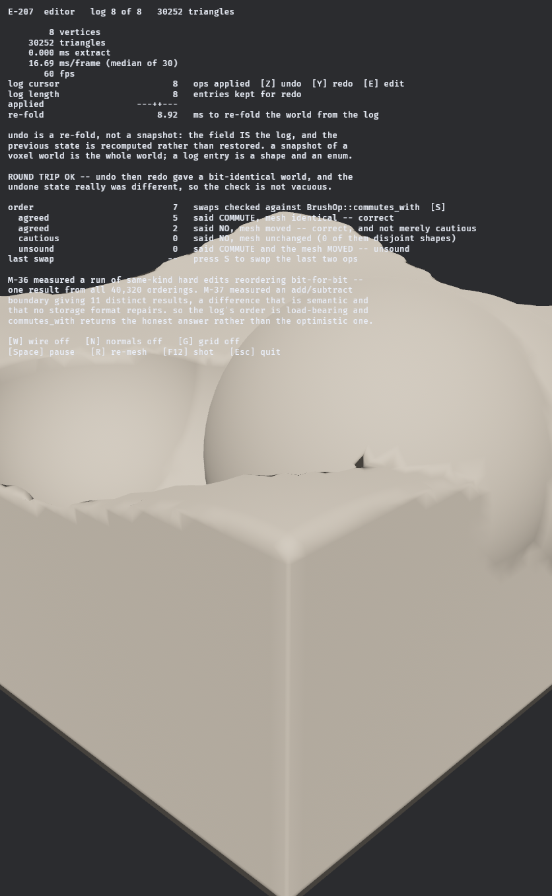

*Eight brushes folded over a block. The field **is** the log — `BrushStack { base, brushes: &log[..cursor] }`
— and undo moves the cursor back by one.*

Nothing is snapshotted. A snapshot of a voxel world is the whole world; a log entry is a shape and an
enum. The previous state is *recomputed*, which costs the re-fold — **8.9 ms** here over 8 ops and 32
chunks, growing with history because every field sample walks the whole log.

Undo then redo returns a **bit-identical** world, checked with an FNV-1a hash over every position and
index so one vertex moving by one bit anywhere fails it. The check also requires the undone state to
have *differed*, or an undo that did nothing would pass.

**The interesting part is the order.** `BrushOp::commutes_with` promises *"the honest answer rather than
an optimistic one: only identical hard operations commute."* This demo audits that against reality —
swap every adjacent pair, re-fold, compare hashes:

| | |
|---|---|
| said commute, mesh bit-identical | **5** |
| said no, mesh moved | **2** |
| said commute and the mesh moved (unsound) | **0** |
| said no, mesh unchanged (conservative) | **0** |

Sound *and* tight. But it answers on operations alone and cannot see shapes, and that is where its
conservatism lives: two brushes that never touch commute whatever their ops are. Run the same audit on
a fixture whose brushes are disjoint and those 2 pairs come back conservative instead — which refines
M-37 rather than contradicting it. Order matters across an add/subtract boundary **when the shapes
overlap**.

That first fixture was the one this demo shipped with, briefly, and it reported **0 of 7 pairs where
order mattered** — on a demo whose entire subject is that order matters.

```bash
cd bevy_isomesh && cargo run --example game_editor --release
```

`Z` undo · `Y` redo · `E` edit · `S` swap the last two ops · `X` clear.

---

## Graffiti that survives the wall it was sprayed on

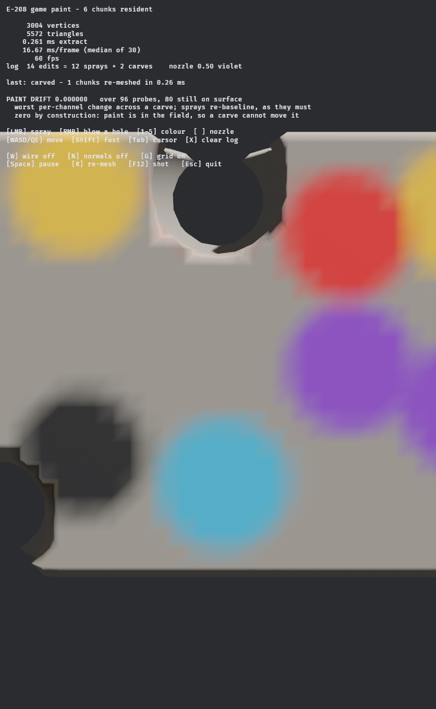

*Twelve sprays, then two holes blown through patches that were definitely painted. The paint around
each hole has not moved, and the freshly exposed rim is bare — paint reaches a fixed depth from the
surface **as it stood when the spray happened**, so a carve exposes material that was never painted.*

The research this demo comes from prices the feature on **L²-nearest attribute transfer over a common
subdivision** — machinery for carrying per-vertex colour from an old mesh to a new one, on the
reasoning that the shared tetrahedral grid is the common refinement so the expensive half comes free.

There is none of it here, because there is nothing to transfer. A world in this crate is a base field
plus an ordered log of edits, so paint goes **in the log**: a splat is an entry alongside the carves,
and colour is a function of world position. The carve moves the surface. The paint was never on the
surface.

So the answer is not a small number, it is an equality:

| | |
|---|---|
| paint drift across two carves | **0.000000** |
| probes whose surface those carves destroyed | 20 of 320 |
| sprays that register drift (the control) | 27 of 40, up to 0.886 |

**That last row is the one that makes the first row mean anything.** The first version of this
measurement sprayed a single colour, so repainting red over red was numerically identical to paint
staying put — it printed `0.000000` at every step and would have printed the same on an implementation
that smeared the paint across the wall. Cycling the palette makes the same instrument sensitive, and
only then is the zero across the carves evidence of anything.

The cost of exactness is that every sample walks the log, and it grows sub-linearly:

| edits in the log | 1–10 | 11–20 | 21–30 | 31–40 |
|---|---|---|---|---|
| ms per re-meshed chunk | 0.1375 | 0.1748 | 0.2450 | 0.3200 |

**2.33× for 40× the log** — the same shape `game_dig` measures for brushes alone. Meshing itself pays
almost nothing for the paint: the field walk skips sprays without evaluating their shapes, and a log
with no sprays in it samples bit-identically to the plain `BrushStack`.

One asymmetry worth knowing before you build on this. A carve changes geometry, so the chunks to
re-mesh come from `mark_edit` comparing the field either side of it. A spray changes **only colour**,
so the field either side is bit-identical and `mark_edit` correctly answers "nothing moved" — its
chunks have to be named geometrically instead, from the nozzle's own bounding box.

```bash
cd bevy_isomesh && cargo run --example game_paint --release
```

`LMB` spray · `RMB` blow a hole · `1`–`5` colour · `[` `]` nozzle · `X` clear the log.

[← back to the README](../../README.md)

---

## A concave edge, moving, measured every frame

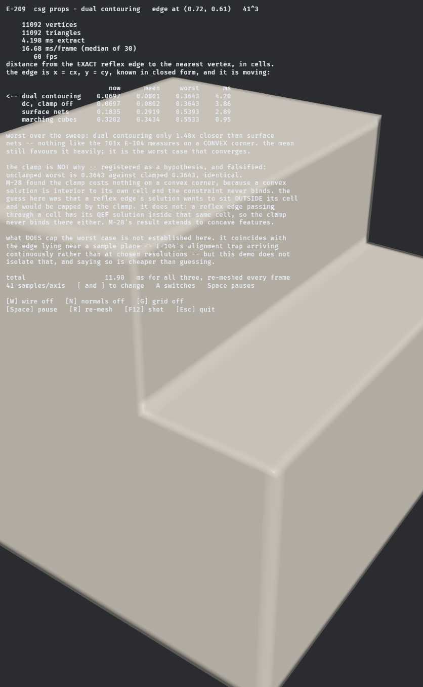

*`solid(p) = max(box(p), min(p.x − cx, p.y − cy))` — a quarter-space subtracted from a block, leaving a
reflex dihedral at exactly `(cx, cy)`. The cutter orbits, so the edge sweeps the grid, and all four
extractions are re-run every frame at 60 fps.*

`dual_contouring_cube` measures a **convex** corner and finds Dual Contouring 101× closer than Surface
Nets. That is the easy case: a convex corner's solution lies inside its own cell. A **concave** edge is
what a CAD tool actually cuts — the inside corner of every pocket — and it comes out very differently:

| | mean | worst |
|---|---:|---:|
| dual contouring | **0.0798** | 0.3481 |
| dual contouring, clamp off | 0.0801 | 0.3481 |
| surface nets | 0.2895 | 0.5426 |
| marching cubes | 0.3412 | 0.5528 |

Distance from the exact edge to the nearest vertex, in cells. Dual Contouring is **3.6× better in the
mean and only 1.56× in the worst case** — decisively better typically, converging toward the others at
the extreme.

**The sweep is what makes that honest.** E-104 measured one static configuration and needed a rule about
which resolutions to skip to defend it against grid alignment. A moving feature is unaligned almost
everywhere and aligned occasionally, and reporting the worst over the sweep is the only way the
occasional case gets counted at all.

**A prediction was registered before the run, and lost.** The guess was that the cell clamp caps Dual
Contouring here — M-28 found it costs nothing on a convex corner because the solution is interior to its
cell, so a reflex edge whose solution "wants to sit outside" ought to be capped by it. Clamped and
unclamped are **identical**, 0.3481 either way. The reasoning was wrong in a simple way: a reflex edge
passing *through* a cell has its solution inside that cell too, so there is nothing to catch. M-28's
result extends to concave features rather than being limited by them.

What *does* cap the worst case is left unestablished. It coincides with the edge lying near a sample
plane, which is E-104's alignment trap arriving continuously, but this demo does not isolate it — and
saying so is cheaper than guessing.

```bash
cd bevy_isomesh && cargo run --example game_csg_props --release
```

`Space` pause · `A` displayed extractor · `[` `]` resolution.

[← back to the README](../../README.md)

---

## A world that streams past you

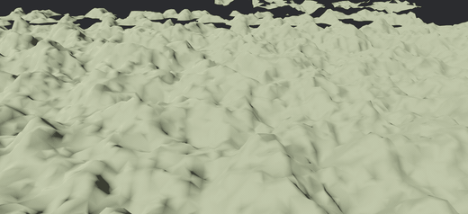

*Chunks loading and unloading continuously as the camera flies. Nothing here is pre-baked — every chunk
in frame was extracted while you were watching.*

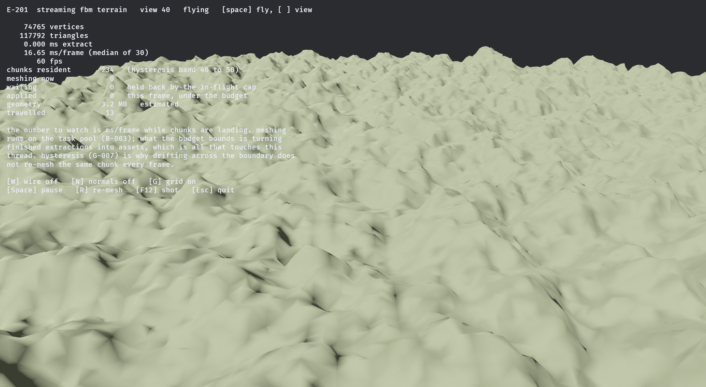

*`game_terrain_stream` — 234 chunks resident, 117,792 triangles, 3.2 MB, **60 fps at 16.65 ms/frame** while the camera flies and chunks load and unload continuously.*

This is the first example where none of the pieces are visible on their own. **G-007** decides which chunks exist, with a hysteresis band so a camera drifting across the boundary does not re-mesh the same chunk every frame. **B-003** extracts them on the async task pool — never in a system — and applies finished meshes under a frame budget. **G-001**'s layout is what makes each chunk's world position exact rather than merely close, which is what stops the seams (M-32).

The number to watch is not the triangle count. It is **ms/frame while chunks are landing**, because a streaming world that hitches is one doing its meshing on the main thread.

One correction is worth repeating, because it is the mistake the API invites. A radius-based residency rule loads a **ball** of chunks, and a heightfield does not need one: the first version held 952 chunks with 606 permanently waiting, and rendered as holes that never filled. Bounding the vertical extent to the two layers that can contain the surface — which is what a real game does — takes it to 234 resident and nothing waiting (M-104).

```bash
cd bevy_isomesh && cargo run --example game_terrain_stream --release
```

`Space` fly/pause · `[` `]` view distance · `W` wireframe.

---

---

## Walking every seam

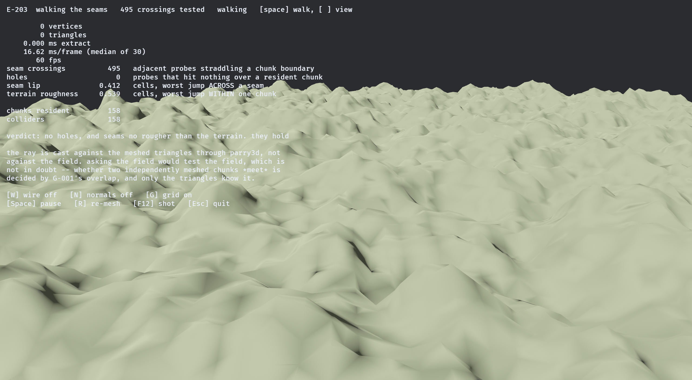

*`game_walk` — **495 seam crossings tested, 0 holes.** The worst vertical discontinuity at a seam is **0.412 cells**, against **0.539 cells** within a single chunk: the joins are smoother than the terrain they join.*

This example is designed to fail. Chunks are meshed independently, and whether two of them actually *meet* is decided by the overlap G-001 chose — get it wrong and you fall through the world at a boundary. So every frame casts a dense transect of rays straight down against the **meshed triangles**, through `parry3d`, and counts holes and lips.

Two details make the answer trustworthy. The ray hits the mesh, not the field — asking the field would test the field, which was never in doubt. And a lip is compared against the terrain's own roughness rather than against zero, because real terrain has real steps and a fixed threshold would be measuring the landscape.

The first version of that test reported **439 holes** and declared the overlap broken. The bug was one operator wide in the test itself: a probe must only count as a hole once *every* chunk layer that could hold the surface has meshed, and the guard said `||` where it needed `&&` (M-105).

```bash
cd bevy_isomesh && cargo run --example game_walk --release
```

`Space` walk/pause · `[` `]` view distance · `W` wireframe.

---

---

## Digging, with the numbers a game actually cares about

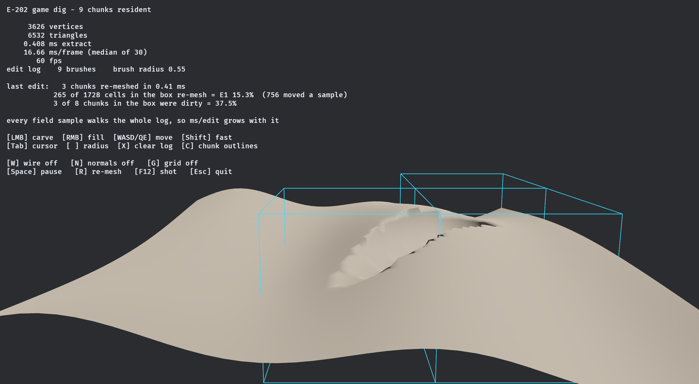

*`game_dig` — first person, left click to carve. The blue boxes are the chunks the **last edit** re-meshed: 3 of them, in `0.41 ms`. Nine chunks are resident; the other six were not touched and were not looked at.*

This is the first example where the mesh is rebuilt while someone is holding the mouse down, and it exists to put two numbers on screen that no benchmark can produce:

- **E1 — `265 of 1,728 cells in the brush's bounding box actually re-mesh, 15.3%.`** That is the number the entire incremental story rests on. If it were 100%, being clever about which cells changed would buy nothing over re-meshing the whole box.
- **The trap next to it: `756 cells moved a sample.`** Counting *value* changes rather than *output* changes reads 43% and says incremental meshing is barely worth it; counting output says 15%. The ratio here is `2.85×`, and it was measured offline at 2.8–3.7× before anyone drove it with a mouse.

Edits compose rather than mutate — the field is a stack of brushes over the terrain, which is what makes undo a re-fold of the log rather than a snapshot. So every field sample walks every brush, and the cost grows. Measured over a scripted 60-carve run, median ms per re-meshed chunk:

| edits in the log | 1–15 | 16–30 | 31–45 | 46–60 |
|---|---|---|---|---|
| ms per chunk | 0.158 | 0.354 | 0.525 | 0.589 |

**3.7× for 7× the log, and flattening** — real, and not proportional, which is weaker than "every sample walks every brush" makes it sound.

```bash
cd bevy_isomesh && cargo run --example game_dig --release
```

`LMB` carve · `RMB` fill · `WASD`/`QE` move · `[` `]` radius · `X` clear the log · `C` chunk outlines.

---

---

## Two levels of detail, and the crack between them

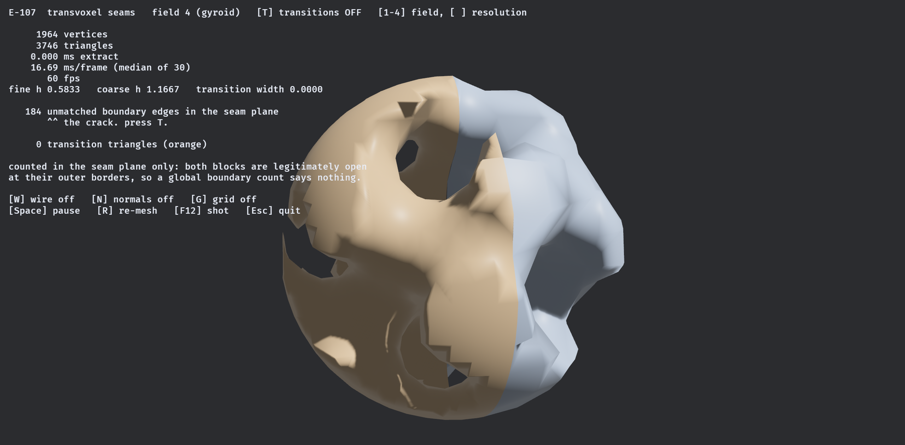

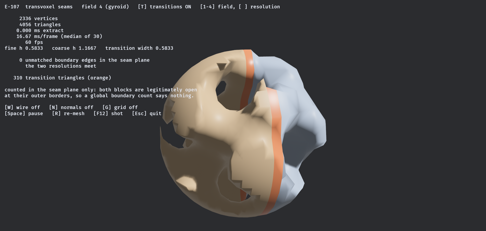

*`transvoxel_seams` — one field, two blocks, the left at full resolution and the right at half. Meshed independently they do not meet: **184 unmatched boundary edges** lie in the seam plane and you can see straight through them. Transition cells take that to **0**, and the orange band is the 310 triangles doing it.*

Both counts are taken **in the seam plane only** — each block is legitimately open at its outer borders, so a global boundary count would drown the signal.

The stitch has a **width**, and that is not cosmetic. A zero-width transition patch also closes the crack — Lengyel says so explicitly — and closing it is *all* it does: every one of its vertices lies in the seam plane, so the patch stands **exactly** perpendicular to the surface it is stitching and shades as a hard crease. Measured: `|cos|` against the surface normal is `0.000` at zero width and `1.000` at `w = 2^(k−2)`. Giving it a width means the coarse block's boundary cells have to be scaled inward by the same amount, which is Lengyel's Equation 4.2 — and written in the block's own cells rather than level-0 cells, the level index cancels out of it entirely.

The property underneath all of it is bit-exactness: a crossing on a half-resolution edge lands on **precisely** the vertex the coarse neighbour's own Marching Cubes pass produced, at every spacing tried including `4/14`. An earlier version of that arithmetic was off by `1.11e-16`, which is a crack no weld can close — a weld merges vertices it can see are the same, and those two are not.

```bash
cd bevy_isomesh && cargo run --example transvoxel_seams --release
```

`T` transitions · `1`–`4` field · `[` `]` resolution.

---

---

## Handing a mesh to a physics engine

`parry3d`'s constructor is not a validity check. Its only documented failure is an empty index buffer — measured, it accepts a zero-area triangle and it accepts a two-chunk mesh with an unwelded seam. A renderer draws that seam correctly; a physics engine reads it as a hole and a character walks through the floor.

So `collider::readiness` reads the validator's report through a collider's eyes and says which of three different things you have:

| | means |
|---|---|
| `is_usable()` | parry will take it and behave — no trailing index, no out-of-range index, no non-finite position |
| `is_seam_free()` | no duplicate vertices, so nothing was assembled from chunks without welding |
| `supports_inside_outside()` | closed, manifold and consistently oriented, so parry's `ORIENTED` pseudo-normals mean something |

They are three predicates rather than one because **a single chunk of a streamed world is open by construction** and is still a perfectly good collider — it just cannot answer "is this point inside". Folding them together would make every chunk in a real world read as broken.

The seam, measured: two adjacent chunks of a torus concatenated give **36 duplicate vertices and 180 boundary edges**. After welding, **0 and 108** — and those 108 are the slab's own outer border, which is genuinely open. The weld closed exactly the 72 that were the seam.

The crate takes no dependency on parry to do this. It emits the `Vec<[u32; 3]>` parry already wants, and the conversion is one line at the call site:

```rust
let indices = isomesh::collider::triangle_indices(&mesh);
let vertices = mesh.positions.iter().map(|p| Vector::new(p[0], p[1], p[2])).collect();
let trimesh = TriMesh::new(vertices, indices)?;
```

---

---

[← back to the README](../../README.md)
